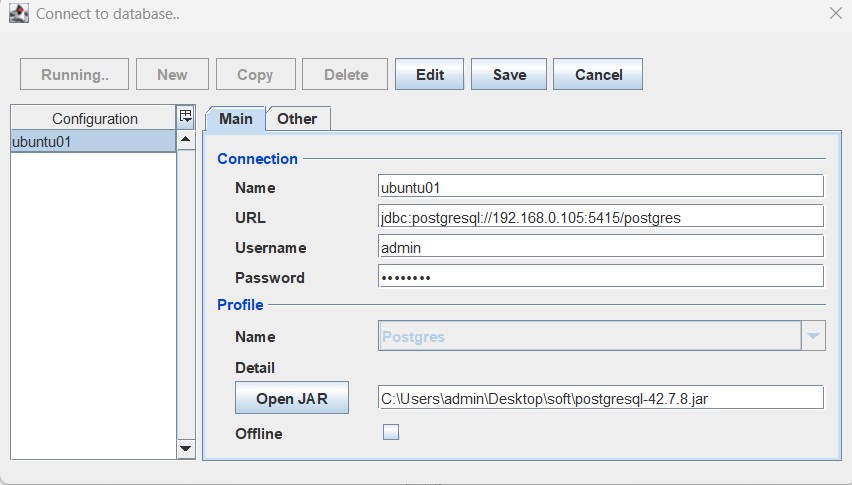
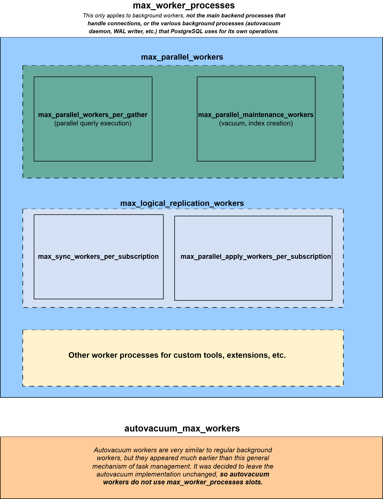

<!--
---
title: "Ad-Hoc"
slug: ad-hoc
created: 2026-07-09
updated: 2026-07-09
author: admin
categories: []
tags: []
pinned: true
description: ""
---
-->

# Ad-Hoc

## Table of Contents

- [Linux](#linux)
  - [Bash prompt](#bash-prompt)
  - [Monitor script example](#monitor-script-example)
  - [Kill group of process](#kill-group-of-process)
  - [Crontab example](#crontab-example)
  - [Mailx](#mailx)
  - [Rename group of files](#rename-group-of-files)
  - [Find and sort files](#find-and-sort-files)
  - [Tar files](#tar-files)
  - [File permissions](#file-permissions)
  - [Replace entries in a file](#replace-entries-in-a-file)
  - [Check locked files after removal](#check-locked-files-after-removal)
  - [Grep log file](#grep-log-file)
  - [Bunch of files quick removal using Perl](#bunch-of-files-quick-removal-using-perl)
  - [SWAP usage by process](#swap-usage-by-process)
  - [Text file recover after cat /dev/null > file.txt](#text-file-recover-after-cat-devnull-filetxt)
  - [Generate SSH keys / passwordless ssh](#generate-ssh-keys-passwordless-ssh)
  - [Listen ports](#listen-ports)
  - [Check network Interface speed](#check-network-interface-speed)
  - [Network Interface speed test using Iperf](#network-interface-speed-test-using-iperf)
  - [Get list of all IPs](#get-list-of-all-ips)
  - [Scan / Rescan SCSI Bus](#scan-rescan-scsi-bus)
  - [Avoid password expire](#avoid-password-expire)
  - [Sar](#sar)
  - [Git](#git)
- [PostgreSQL](#postgresql)
  - [Restore / Recover / Backup / PITR / Dump](#restore-recover-backup-pitr-dump)
  - [Flyway example](#flyway)
  - [Liquibase example](#liquibase)
  - [PgBench](#pgbench)
  - [pg_waldump](#pg_waldump)
  - [ASH Viewer](#ash-viewer)
  - [JDBC Connection string examples](#jdbc-connection-string-examples)
  - [Postgres Workers Parameters](#postgres-workers-parameters)
  - [Parallel Index Creation](#parallel-index-creation)
  - [Postgres to Java Data types mapping](#postgres-to-java-data-types-mapping)
  - [Query to Kill Multiple Sessions](#query-to-kill-multiple-sessions)
  - [Certificates / SSL / TLS](#certificates-ssl-tls)

## Linux

### Bash prompt

```bash
export PS1='\[\033[0;32m\]$ORACLE_SID> \[\033[0;33m\]\u@\h\[\033[00m\] [\t] \w]\$ '
```

### Monitor script example

```bash
while true; do df -hT . && sleep 5; done;
```

### Kill group of process

```bash
ps -fu $LOGNAME | grep java | awk '{print $2}' | xargs kill -9
```

### Crontab example

```bash
5 0 * * * /home/oracle/dba/scripts/audit_cleanup.sh > /home/oracle/dba/logs/audit_cleanup.log 2>&1 &
```

### Mailx

- [Utility keys description](https://www.computerhope.com/unix/umailx.htm)
- [Command examples](https://www.binarytides.com/linux-mailx-command/)

```bash
echo "" | mailx -S smtp=your.smtp.server.com -s "Test" -r "from-me@gmail.com" receiver@gmail.ru;
```

### Rename group of files

```bash
$ touch 1_1 1_2 1_3
$ ls -ltr
total 0
-rw-r--r-- 1 oracle oinstall 0 Nov 26 13:05 1_3
-rw-r--r-- 1 oracle oinstall 0 Nov 26 13:05 1_2
-rw-r--r-- 1 oracle oinstall 0 Nov 26 13:05 1_1
 
$ for i in 1_*; do mv "$i" arch_"${i/1_/}"; done
 
$ ls -ltr
total 0
-rw-r--r-- 1 oracle oinstall 0 Nov 26 13:05 arch_3
-rw-r--r-- 1 oracle oinstall 0 Nov 26 13:05 arch_2
-rw-r--r-- 1 oracle oinstall 0 Nov 26 13:05 arch_1
```

### Find and sort files

Find example and explanation:

```bash
find . -type f -mtime +1 -size +5000 -exec ls -l {} \; -exec gzip {} \;
  
#where . - it is directory where you situated
#where -mtime  -  File's  data was last modified n*24 hours ago.
#where -size +5000 - size 5MB
#where exec \; - execution of comands
#where ls -l - making the result more readable
#where {} - it is the area that is dedicated by find where we need to execute command
#where exec gzip {} \; - gzip files that are dedicated by find
```

Find by size:

```bash
find . -size +5M -exec ls -l {} \;
```

Find by age:

```bash
find . -name "*.aud" -mtime +7 -exec ls {} \;
find . -name "*.aud" -mtime +7 -exec gzip -9 {} \;
```

Find all Symlinks (symbolic links):

```bash
cd $ORACLE_HOME/..
find . -type l -exec ls -l {} \;
```

Find and sort files by size:

```bash
find . -name "*.trc" -type f -exec du -Sh {} + | sort -rh | head -n 5
```

### Tar files

Tar directory and all subdirectories:

```bash
tar -cvzf /u01/app/12.1.0.2/grid12102.tar.gz /u01/app/12.1.0.2/grid
 
#-c == --create         == create new archive
#-v == --verbose        == verbosely list files processed (выводит список файлов которые тарит на данный момент)
#-z == --gzip           == filter the archive through gzip
#-f == --file=ARCHIVE   == use archive file or device ARCHIVE (обычно просто пишем итоговое имя архива и где он будет располагаться)
```

Untar (extract) from archive:

```bash
tar -zxvf /u01/app/12.1.0.2/grid12102.tar.gz
 
#-x == --extract, --get == extract files from an archive
```

### File permissions

```bash
# user | group | others
0 | 0 0 0  - - -  No permission
1 | 0 0 1  - - x  Only execute permission
2 | 0 1 0  - w -  Only write/modify permission
3 | 0 1 1  - w x  Only write and execute permission
4 | 1 0 0  r - -  Only read permission
5 | 1 0 1  r - x  Only read and execute permission
6 | 1 1 0  r w -  Only read and write permission
7 | 1 1 1  r w x  Read, write and execute permission

4 - read
2 - write/modify
1 - execute
```

### Replace entries in a file

From Vim:

```bash
$ vi file.txt
:%s/old-text/new-text/g
```

From Perl:

```bash
$ perl -pi -e 's:woody:buzz:g' file.txt
```

### Check locked files after removal

```bash
lsof -nP | grep '(deleted)'
```

### Grep log file

Set log file mask:

```bash
export PG_LOGS="postgresql*.log*"
export PGB_LOGS="pgbouncer*.log*"
```

Truncate log file for a specific time interval:

```bash
awk '/^2025-01-20 13:[0-5][0-9]:[0-5][0-9]/ {p=1} /^2025-01-20 14:[0-5][0-9]:[0-5][0-9]/ {p=0} p' postgresql-*.log > period__T1_T2.log
```

All DB errors:

```bash
grep -i -E "WARNING|ERROR|FATAL|PANIC|corrupt|locked|COMMIT|broken|EOF|Segmentation fault|immediate shutdown|crash of another|holding the lock|deadlock" $PG_LOGS > errors_db_all.log
```

All pgBouncer errors:

```bash
grep -i -E "ERR|FATA|client_login_timeout|server_lifetime|cannot|eof" $PGB_LOGS > errors_pgbouncer.log
```

Blocking sessions / Deadlocks:

```bash
grep -i -E "waiting|locked|holding the lock|deadlock|lock:" $PG_LOGS > locks.log
```

Long running SQL (depends on `log_min_duration_statement` parameter value):

```bash
grep -i -E "duration:" $PG_LOGS > long_running_queries.log
```

Temp files:

```bash
grep -i -E  "pgsql_tmp" $PG_LOGS > temp_files.log
```

Messages related to COMMIT/ROLLBACK:

```bash
grep -i -E "commit|rollback:" $PG_LOGS > commit_rollback.log
```

Application related issues:

```bash
grep -i -E  "duplicate|key|uniq|violates|constraint" $PG_LOGS > app_issues.log
```

Connection lifetime:

```bash
grep -i -E  "session time" $PG_LOGS | grep -v -E "user=postgres" > sess_time.log
```

### Bunch of files quick removal using Perl

```bash
cd /directory
perl -e 'for(<*>){((stat)[9]<(unlink))}'
```

### SWAP usage by process

[Source](https://www.cyberciti.biz/faq/linux-which-process-is-using-swap/)

```bash
for file in /proc/*/status ; do awk '/VmSwap|Name/{printf $2 " " $3}END{ print ""}' $file; done | sort -k 2 -n -r | less
```

### Text file recover after cat /dev/null > file.txt

```bash
dd if=/dev/sda1 | fgrep -B 7 -A 10 --text "Some text from your file to search" > /tmp/recovered_file
 
#if = partition where file system with your damaged file is located
#-B = N line before search pattern
#-A = N lines after search pattern
#>  = output file should be placed on another partition with enough disk space
```

### Generate SSH keys / passwordless ssh

```bash
{ mkdir -p ~/.ssh
ssh-keygen -f ~/.ssh/id_rsa -t rsa -b 4096 -N ""
chmod 700 ~/.ssh
chmod 600 ~/.ssh/authorized_keys
chmod 755 ~
}
 
echo "ssh-rsa assadasdasd" >> ~/.ssh/authorized_keys
```

### Listen ports

```bash
netstat -tulpan | grep -i listen
```

### Check network Interface speed

```bash
$ lspci | egrep -i --color 'network|ethernet'
01:00.0 Ethernet controller: Intel Corporation 82576 Gigabit Network Connection (rev 01)
01:00.1 Ethernet controller: Intel Corporation 82576 Gigabit Network Connection (rev 01)
07:00.0 Ethernet controller: Intel Corporation 82576 Gigabit Network Connection (rev 01)
07:00.1 Ethernet controller: Intel Corporation 82576 Gigabit Network Connection (rev 01)
13:00.0 Ethernet controller: Intel Corporation 82599ES 10-Gigabit SFI/SFP+ Network Connection (rev 01)
13:00.1 Ethernet controller: Intel Corporation 82599ES 10-Gigabit SFI/SFP+ Network Connection (rev 01)
 
$ ethtool eth0 | grep -i speed
```

### Network Interface speed test using Iperf

Sources:

- https://www.linode.com/docs/networking/diagnostics/install-iperf-to-diagnose-network-speed-in-linux/
- https://www.slashroot.in/iperf-how-test-network-speedperformancebandwidth
- http://winitpro.ru/index.php/2014/11/05/testirovanie-propusknoj-sposobnosti-seti-s-iperf/

```bash
[root@SERVER~]# iperf -s -w 32768 -p 4444
 
[root@CLIENT~]# iperf -c 10.74.24.2 -p 4444 -P 32 -t 30 -w 32768
```

### Get list of all IPs

```bash
ip -a address
```

### Scan / Rescan SCSI Bus

[Source](https://geekpeek.net/rescan-scsi-bus-on-linux-system/)

```bash
## Check
 
find /sys -name scan

## Monitor log using following before running below commands: tail -20f /var/log/messages
 
echo "1" > /sys/class/fc_host/host7/issue_lip
echo "- - -" > /sys/class/scsi_host/host7/scan
 
echo "1" > /sys/class/fc_host/host8/issue_lip
echo "- - -" > /sys/class/scsi_host/host8/scan
 
## Check new size

lsblk /dev/sddlmab
 
## Re-scan:
 
echo 1> /sys/class/block/sdf/device/rescan
```

### Avoid password expire

```bash
## Check current settings
 
chage -l oracle

## Change
 
chage -m 0 -M -1 -E -1 oracle
```

### Sar

Sources:

- [How can I configure and use SAR to monitor performance metrics on my Amazon EC2 Linux instance?](https://repost.aws/knowledge-center/ec2-linux-monitor-performance-with-sar)
- [Collect and report Linux System Activity Information with sar](https://www.thomas-krenn.com/en/wiki/Collect_and_report_Linux_System_Activity_Information_with_sar)
- [10 Useful Sar (Sysstat) Examples for UNIX / Linux Performance Monitoring](https://www.thegeekstuff.com/2011/03/sar-examples/)

#### CPU

```bash
sar -P ALL 1 1
## run queue and load average
sar -q 1 3
```

#### Memory

```bash
sar -r 1 3
```

#### Swap

```bash
sar -S 1 3
```

#### Disk I/O

```bash
sar -d -p 2 5
```

#### Network

```bash
sar -n ALL
```

#### Historical

```bash
## Run queue
sar -q -s 07:50:00 -e 08:00:00 -f /var/log/sa/sa01
 
## DISK
sar -dp -s 07:50:00 -e 08:00:00 -f /var/log/sa/sa01 | grep -E 'DEV|swap'
 
## NETWORK
sar -n ALL -s 07:50:00 -e 08:00:00 -f /var/log/sa/sa01 | less
 
## ALL stats
sar -A -s 07:50:00 -e 08:00:00 -f /var/log/sa/sa01 | less
```

### Git

```bash
TODO
```

## PostgreSQL

### Restore / Recover / Backup / PITR / Dump

#### pg_dump

```bash
## Backup:
pg_dump -Z1 -Fc db_name > /backup/db_name_<date>.dump
 
## Restore:
pg_restore -j 2 -d db_name /backup/db_name_<date>.dump
```

#### pg_basebackup

```bash
## Backup:
pg_basebackup -h ${HOSTNAME} -p 5432 -U bkp_usr -D /backup/<date> -Ft -z -Xs -P
 
## Restore:
tar -xzf /pgdata/backup_tests/pg_basebackup/base.tar.gz -C /pgdata/12/data
tar -xzf /pgdata/backup_tests/pg_basebackup/pg_wal.tar.gz -C /pgdata/12/data/pg_wal
tar -xzf /pgdata/backup_tests/pg_basebackup/16393.tar.gz -C /pgdata/12/ts/bench_db_data
tar -xzf /pgdata/backup_tests/pg_basebackup/16394.tar.gz -C /pgdata/12/ts/bench_db_idx
```

#### pg_probackup

```bash
export CLNAME="patroni_cluster"
export BKP_DIR="/mnt/pgbackup/backup"
export EXT_DIR="/etc/pgbouncer:/etc/etcd:/etc/patroni"
 
## Prepare:
pg_probackup init -B $BKP_DIR
pg_probackup add-instance -B $BKP_DIR -D $PGDATA --instance $CLNAME
pg_probackup show -B $BKP_DIR --instance $CLNAME
pg_probackup set-config -B $BKP_DIR --instance $CLNAME --archive-timeout='10min' --retention-redundancy=7 --retention-window=7
 
## Backup:
pg_probackup backup -B $BKP_DIR --instance $CLNAME -b FULL --compress --stream --temp-slot -E $EXT_DIR -j 2 --delete-expired --delete-wal -U postgres
pg_probackup show -B $BKP_DIR --instance $CLNAME
 
## Restore:
pg_probackup restore -B $BKP_DIR --instance=$CLNAME -D $PGDATA -i RYU7ZV -j 2 --recovery-target='immediate' --progress --log-level-file=verbose --log-filename=restore_$(date +%Y%m%d)T$(date +%H%M%S).log --skip-external-dirs
 
## Restore PITR:
pg_probackup restore -B $BKP_DIR --instance=$CLNAME -D $PGDATA -j 2 --recovery-target-time='2022-08-04 22:20:00' --progress --log-level-file=verbose --log-filename=restore_$(date +%Y%m%d)T$(date +%H%M%S).log --skip-external-dirs
 
## Remove backup:
pg_probackup  delete -B ${BKP_DIR} --instance ${CLNAME} -i XYZ
```

#### pgBackRest

```bash
## TODO
```

#### wal-g

```bash
## TODO
```

#### barman

```bash
## TODO
```

#### archive_command / restore_command examples

```bash
## default
archive_command = 'test ! -f /pgdata/arch/%f.gz && gzip < %p > /pgdata/arch/%f.gz'
restore_command = 'scp postgres@srv-ubuntu-pgdb2.test.com:/pgdata/arch/%f.gz /pgdata/13/data/pg_wal/%f.gz && gunzip < /pgdata/13/data/pg_wal/%f.gz > %p && rm -f /pgdata/13/data/pg_wal/%f.gz'
 
## pgBackRest
todo
 
## pg_probackup
todo
 
## wal-g
todo
 
## barman
todo
```

### Flyway example

[Download](https://flywaydb.org/download/)

```bash
##
## Oracle
##
 
$ /oracle/soft/flyway-5.0.7/flyway migrate -ConfigFiles=/oracle/soft/migration_file.config
   
##
## Config example:
##
 
$ cat /oracle/soft/migration_file.config
++++++++++++++++++++
flyway.baselineOnMigrate=true
flyway.baselineVersion=0
flyway.user=APPS
flyway.password=***
flyway.url=jdbc:oracle:thin:@111.222.333.444:1521:oraclesid
flyway.locations=filesystem:/oracle/soft/migration
flyway.table=flyway_schema_history
   
flyway.placeholders.tbsTables=APPS_T
flyway.placeholders.tbsTablesSize=1G
flyway.placeholders.tbsTablesDataFile=/oradata/ORCL/apps_t_01.dbf
++++++++++++++++++++
```

### Liquibase example

[Download](https://www.liquibase.org/download)

```bash
##
## Oracle
##
   
$ java -jar "/oracle/soft/liquibase.jar" --classpath=/oracle/soft/oracle_jdbc.jar --username=APPS --password=*** --url=jdbc:oracle:thin:@111.222.333.444:1521:oraclesid --defaultSchemaName=APPS --changeLogFile=/oracle/soft/changelog.xml --logLevel=info update -Dtablespace_t=APPS_T -Dtablespace_i=APPS_I -Dtablespace_l=APPS_L -Donline_user=APPS -Ddefault_password=***
   
##
## PostgreSQL
##
   
$ java -jar "/home/postgres/soft/liquibase.jar" --classpath=/home/postgres/soft/postgresql_jdbc.jar --username=apps --password=*** --url=jdbc:postgresql://111.222.333.444:5432/pgdbname --changeLogFile=/home/postgres/soft/changelog.xml --logLevel=info --driver=org.postgresql.Driver update -Drole=RISKMETRICS_ROLE -Dtablespace_t=APPS_T -Dtablespace_i=APPS_I -Dtablespace_l=APPS_L -Ddefault_password=***
   
Note: variables above could vary.
```

### PgBench

Docs:

- [pgbench docs (ru)](https://postgrespro.ru/docs/postgresql/current/pgbench)
- [Franck Pachot - pgbench --client --jobs](https://dev.to/yugabyte/pgbench-client-jobs-68g)
- [Franck Pachot - Do you know what you are measuring with pgbench?](https://franckpachot.medium.com/do-you-know-what-you-are-measuring-with-pgbench-d8692a33e3d6)

Prepare and Init database:

```bash
>>> Simple <<<

pgbench --initialize --scale=70 --port=5415 test_db

>>> Dedicated user/tablespaces example <<<

psql> create user bench_usr with encrypted password '***';
psql> \! mkdir -p /pgdata001/12/tbs/data_tbs		<<<<< Create same dir on Replica server!!!
psql> \! mkdir -p /pgdata002/12/tbs/idx_tbs		<<<<< Create same dir on Replica server!!!
psql> create tablespace data_tbs owner bench_usr location '/pgdata001/12/tbs/data_tbs';
psql> create tablespace idx_tbs owner bench_usr location '/pgdata002/12/tbs/idx_tbs';
psql> create database bench_db with owner=bench_usr tablespace=data_tbs;
psql> \c bench_db	<<<<< Create extension if you want (pg_buffercache, pg_stat_statements, pg_stat_kcache, etc ...)

pgbench --initialize --scale=50 --tablespace=data_tbs --index-tablespace=idx_tbs --user=bench_usr --host=${HOSTNAME} --port=5432 bench_db
```

Start Load:

```bash
>>> Default <<<

pgbench -h /tmp -p 5415 -c 10 -j 6 -P 5 -T 900 postgres
pgbench -h $HOSTNAME -p 5432 -U bench_usr -c 50 -j 2 -P 60 -T 300 bench_db

>>> No Vacuum <<<

pgbench -h /tmp -p 5415 -c 10 -j 6 -P 5 -T 900 --no-vacuum postgres
pgbench -h $HOSTNAME -p 5432 -U bench_usr -c 50 -j 2 -P 60 -T 300 --no-vacuum bench_db

>>> Select Only <<<

pgbench -h /tmp -p 5415 -c 10 -j 6 -P 5 -T 900 --no-vacuum -b select-only postgres
pgbench -h $HOSTNAME -p 5432 -U bench_usr -c 50 -j 2 -P 60 -T 300 --no-vacuum -b select-only bench_db

>>> Simple-Update (no blocking sessions) <<<

pgbench -h /tmp -p 5415 -c 10 -j 6 -P 5 -T 900 --no-vacuum -b simple-update postgres
pgbench -h $HOSTNAME -p 5432 -U bench_usr -c 50 -j 2 -P 60 -T 300 --no-vacuum -b simple-update bench_db

>>> Custom script example with logging into a file <<<

echo "select count(*) from pgbench_accounts;" > custom.sql
pgbench -h /tmp -p 5415 -c 10 -j 6 -P 5 -T 900 --no-vacuum -f custom.sql postgres 2>&1 | while IFS= read -r line; do echo "$(date '+%Y-%m-%d %H:%M:%S'): $line"; done | tee -a pgbench_custom.log

>>> Prepared to avoid planning each query overhead <<<

pgbench -h /tmp -p 5415 -c 10 -j 6 -P 5 -T 900 --no-vacuum -b simple-update -M prepared postgres
```

<details>
<summary>pgbench -V && pgbench --help</summary>

```text
pgbench (PostgreSQL) 15.14
pgbench is a benchmarking tool for PostgreSQL.

Usage:
  pgbench [OPTION]... [DBNAME]

Initialization options:
  -i, --initialize         invokes initialization mode
  -I, --init-steps=[dtgGvpf]+ (default "dtgvp")
                           run selected initialization steps
  -F, --fillfactor=NUM     set fill factor
  -n, --no-vacuum          do not run VACUUM during initialization
  -q, --quiet              quiet logging (one message each 5 seconds)
  -s, --scale=NUM          scaling factor
  --foreign-keys           create foreign key constraints between tables
  --index-tablespace=TABLESPACE
                           create indexes in the specified tablespace
  --partition-method=(range|hash)
                           partition pgbench_accounts with this method (default: range)
  --partitions=NUM         partition pgbench_accounts into NUM parts (default: 0)
  --tablespace=TABLESPACE  create tables in the specified tablespace
  --unlogged-tables        create tables as unlogged tables

Options to select what to run:
  -b, --builtin=NAME[@W]   add builtin script NAME weighted at W (default: 1)
                           (use "-b list" to list available scripts)
  -f, --file=FILENAME[@W]  add script FILENAME weighted at W (default: 1)
  -N, --skip-some-updates  skip updates of pgbench_tellers and pgbench_branches
                           (same as "-b simple-update")
  -S, --select-only        perform SELECT-only transactions
                           (same as "-b select-only")

Benchmarking options:
  -c, --client=NUM         number of concurrent database clients (default: 1)
  -C, --connect            establish new connection for each transaction
  -D, --define=VARNAME=VALUE
                           define variable for use by custom script
  -j, --jobs=NUM           number of threads (default: 1)
  -l, --log                write transaction times to log file
  -L, --latency-limit=NUM  count transactions lasting more than NUM ms as late
  -M, --protocol=simple|extended|prepared
                           protocol for submitting queries (default: simple)
  -n, --no-vacuum          do not run VACUUM before tests
  -P, --progress=NUM       show thread progress report every NUM seconds
  -r, --report-per-command report latencies, failures, and retries per command
  -R, --rate=NUM           target rate in transactions per second
  -s, --scale=NUM          report this scale factor in output
  -t, --transactions=NUM   number of transactions each client runs (default: 10)
  -T, --time=NUM           duration of benchmark test in seconds
  -v, --vacuum-all         vacuum all four standard tables before tests
  --aggregate-interval=NUM aggregate data over NUM seconds
  --failures-detailed      report the failures grouped by basic types
  --log-prefix=PREFIX      prefix for transaction time log file
                           (default: "pgbench_log")
  --max-tries=NUM          max number of tries to run transaction (default: 1)
  --progress-timestamp     use Unix epoch timestamps for progress
  --random-seed=SEED       set random seed ("time", "rand", integer)
  --sampling-rate=NUM      fraction of transactions to log (e.g., 0.01 for 1%)
  --show-script=NAME       show builtin script code, then exit
  --verbose-errors         print messages of all errors

Common options:
  -d, --debug              print debugging output
  -h, --host=HOSTNAME      database server host or socket directory
  -p, --port=PORT          database server port number
  -U, --username=USERNAME  connect as specified database user
  -V, --version            output version information, then exit
  -?, --help               show this, then exit
```

</details>

### pg_waldump

Stat between two WAL files:

```bash
pg_waldump -z walname1 walname2
```

Check WAL content:

```bash
pg_waldump walname01 | less
```

### ASH Viewer

- [GitHub - ASH Viewer](https://github.com/akardapolov/ASH-Viewer)
- 1) [Download](https://jdk.java.net/archive/) and install Java
- 2) [Download](https://jdbc.postgresql.org/download/) PostgreSQL JDBC driver
- 3) Start ASH Viewer

Windows:

```bash
 ## Open CMD as Administrator
cmd> setx /m JAVA_HOME "C:\Users\admin\Desktop\soft\openjdk-11.0.2_windows-x64_bin\jdk-11.0.2"
 
cmd> echo %JAVA_HOME%
C:\Users\admin\Desktop\soft\openjdk-11.0.2_windows-x64_bin\jdk-11.0.2
 
cmd> java -version
openjdk version "11.0.2" 2019-01-15
OpenJDK Runtime Environment 18.9 (build 11.0.2+9)
OpenJDK 64-Bit Server VM 18.9 (build 11.0.2+9, mixed mode)
 
cmd> setx /m ASHV_HOME "C:\Users\admin\Desktop\soft\ashv-4.4.1-bin\ashv-4.4.1-bin"
 
## Restart CMD
 
## Edit "%ASHV_HOME%/run.bat" script with your JAVA related variables
 
cmd> cd /d %ASHV_HOME%
 
cmd> run.bat
```

Linux:

```bash
export ASHV_VERSION="4.4.1"
export ASHV_HOME="/home/user/soft/ash-viewer"
export ASHV_BIN="$ASHV_HOME/ashv-$ASHV_VERSION-bin"
export ASHV_LOGS="$ASHV_HOME/logs"
export JAVA_HOME="/home/user/soft/jre"
 
alias cdashv="cd $ASHV_HOME"
alias cdashvbin="cd $ASHV_BIN"
alias cdashvlogs="cd $ASHV_HOME/logs"
 
alias ashv="cd $ASHV_BIN && nohup $JAVA_HOME/bin/java -Xmx1024m -Dsun.java2d.uiScale=1.0 -cp \"$ASHV_BIN/ashv.jar:$ASHV_BIN/bc-noncert-1.0.2.4.jar\" Main > $ASHV_LOGS/ashv_sess_$(date +%Y%m%d)T$(date +%H%M%S).log 2>&1 &"
```

Connection details example:



### JDBC Connection string examples

TODOTODOTODO

```bash
TODOTODOTODO
```

### Postgres Workers Parameters

**Docs:**

- [Maxing out max_parallel_workers in Postgres](https://jamesguthrie.ch/blog/maxing-out-max-parallel-workers/)
- [Increasing max parallel workers per gather in Postgres](https://www.pgmustard.com/blog/max-parallel-workers-per-gather)
- [Workers of the World, Unite!](https://thebuild.com/blog/2023/02/28/workers-of-the-world-unite/)

**Scheme:**



### Parallel Index Creation

**Docs:**

- [CYBERTEC | PostgreSQL: Parallel CREATE INDEX for better performance](https://www.cybertec-postgresql.com/en/postgresql-parallel-create-index-for-better-performance/)
- [CYBERTEC | Speeding up index creation in PostgreSQL](https://www.cybertec-postgresql.com/en/speeding-up-index-creation-in-postgresql/)
- [POSTGRESAI | Useful notes abount Indexing](https://postgres.ai/docs/postgres-howtos/performance-optimization/indexing/)
- [POSTGRESAI | How to rebuild many indexes using many backends avoiding deadlocks](https://postgres.ai/docs/postgres-howtos/performance-optimization/indexing/rebuild-indexes-without-deadlocks)
- [DOCS | Building Indexes Concurrently](https://www.postgresql.org/docs/current/sql-createindex.html#SQL-CREATEINDEX-CONCURRENTLY)
- [BOOK | Egor Rogov. PostgreSQL 14 Internals. Moscow, 2023., page 305](https://edu.postgrespro.com/postgresql_internals-14_en.pdf)
- [SOURCE CODE | Block about calculating the number of parallel workers](https://github.com/postgres/postgres/blob/576b25bfd0e9a1d5bbc54931e888135bc6da8a2f/src/backend/optimizer/path/allpaths.c#L4165-L4181)

**Example:**

```sql
SET maintenance_work_mem = '128GB';
SET max_parallel_maintenance_workers = 96;

ALTER TABLE mytable SET (parallel_workers = 96);

CREATE INDEX IF NOT EXISTS idx_mytable_id_status on mytable(id) WHERE status IS NOT NULL;

ALTER TABLE mytable RESET (parallel_workers);
```

*Increasing `max_parallel_workers` setting within a session does not guarantee that the specified number of parallel workers will actually be used during table scanning for index creation. Decision about how many parallel workers will be used for a `CREATE INDEX` command is made by the PostgreSQL Optimizer based on `log(3, relpages)` formula. To bypass the optimizer's decision, set the `parallel_workers` parameter at the table level as shown above.*

**Notes:**

- In case of `CONCURRENTLY` option with parallel settings above - [only the first table scan is actually performed in parallel.](https://www.postgresql.org/docs/current/sql-createindex.html#SQL-CREATEINDEX-CONCURRENTLY)
- Reindexing several indexes on one table with `CONCURRENTLY` option may cause deadlocks.
- Above example works only for NON-partitioned tables. If you need to build index for partitioned table in parallel you can create index for each partitioned and then run create index on parent table. [Such method is also used for `CONCURRENTLY` option for partitioned tables.](https://www.postgresql.org/docs/current/sql-createindex.html#SQL-CREATEINDEX-CONCURRENTLY)
- Note about `parallel_workers` [setting for a single table by Laurenz Albe.](https://www.cybertec-postgresql.com/en/postgresql-parallel-create-index-for-better-performance/)

### Postgres to Java Data types mapping


### Query to Kill Multiple Sessions

Check:

```sql
SELECT datname, pid, usename, state, wait_event_type||':'||wait_event as we, substr(query,1,100)
FROM pg_stat_activity
WHERE pid <> pg_backend_pid()
AND usename LIKE 'apps%'
--AND now() - query_start > INTERVAL '5 minutes';
```

Kill:

```sql
SELECT pg_terminate_backend(pid)
FROM pg_stat_activity
WHERE pid <> pg_backend_pid()
AND usename LIKE 'apps%'
--AND now() - query_start > INTERVAL '5 minutes';
```

### Certificates / SSL / TLS

Check PG server cert:

```bash
openssl s_client -starttls postgres -connect $HOSTNAME:5432
```

**NOTE**: When certificate is self-signed, then issuer and subject field contains the same value.

Check SSL settings in DB:

```bash
select name, setting, context from pg_settings where name like 'ssl%' order by name;
```

CA + Server certs:

```bash
{
mkdir -p ~/ssl
openssl req -new -x509 -days 730 -nodes -out /home/postgres/ssl/root.crt -keyout /home/postgres/ssl/root.key -subj "/CN=test-ca"
openssl req -new -nodes -out /home/postgres/ssl/srv-pg-db01.ru-central1.internal.csr -keyout /home/postgres/ssl/srv-pg-db01.ru-central1.internal.key -subj "/CN=srv-pg-db01.ru-central1.internal" -config /etc/pki/tls/openssl.cnf
openssl x509 -req -in /home/postgres/ssl/srv-pg-db01.ru-central1.internal.csr -days 730 -CA /home/postgres/ssl/root.crt -CAkey /home/postgres/ssl/root.key -CAcreateserial -out /home/postgres/ssl/srv-pg-db01.ru-central1.internal.crt
chmod 700 ~/ssl/ && chmod 600 ~/ssl/*.key && rm -f ~/ssl/*.srl ~/ssl/*.csr
}
```

Client (postgres) cert:

```bash
{
openssl req -new -nodes -out /home/postgres/ssl/client.csr -keyout /home/postgres/ssl/client.key -subj "/CN=postgres"
openssl x509 -req -in /home/postgres/ssl/client.csr -days 100 -CA /home/postgres/ssl/root.crt -CAkey /home/postgres/ssl/root.key -CAcreateserial -out /home/postgres/ssl/client.crt
chmod 700 ~/ssl/ && chmod 600 ~/ssl/*.key && rm -f ~/ssl/*.srl ~/ssl/*.csr
}
```

Client (ssl_user):

```bash
{
openssl req -new -nodes -out /home/postgres/ssl/client_ssl_user.csr -keyout /home/postgres/ssl/client_ssl_user.key -subj "/CN=ssl_user"
openssl x509 -req -in /home/postgres/ssl/client_ssl_user.csr -days 100 -CA /home/postgres/ssl/root.crt -CAkey /home/postgres/ssl/root.key -CAcreateserial -out /home/postgres/ssl/client_ssl_user.crt
chmod 700 ~/ssl/ && chmod 600 ~/ssl/*.key && rm -f ~/ssl/*.srl ~/ssl/*.csr
}
```

Client (ssl_user) EXPIRED:

```bash
#yum install faketime
 
{
openssl req -new -nodes -out /home/postgres/ssl/client_ssl_user_expired.csr -keyout /home/postgres/ssl/client_ssl_user_expired.key -subj "/CN=ssl_user"
faketime '2008-12-24 08:15:42' openssl x509 -req -in /home/postgres/ssl/client_ssl_user_expired.csr -days 730 -CA /home/postgres/ssl/root.crt -CAkey /home/postgres/ssl/root.key -CAcreateserial -out /home/postgres/ssl/client_ssl_user_expired.crt
chmod 700 ~/ssl/ && chmod 600 ~/ssl/*.key && rm -f ~/ssl/*.srl ~/ssl/*.csr
openssl x509 -in client_ssl_user_expired.crt -text -noout | grep -iA2 validity
}
```

Client (ssl_user) WRONG /CN:

```bash
{
openssl req -new -nodes -out /home/postgres/ssl/client_ssl_user_wrong_cn.csr -keyout /home/postgres/ssl/client_ssl_user_wrong_cn.key -subj "/CN=abc"
openssl x509 -req -in /home/postgres/ssl/client_ssl_user_wrong_cn.csr -days 100 -CA /home/postgres/ssl/root.crt -CAkey /home/postgres/ssl/root.key -CAcreateserial -out /home/postgres/ssl/client_ssl_user_wrong_cn.crt
chmod 700 ~/ssl/ && chmod 600 ~/ssl/*.key && rm -f ~/ssl/*.srl ~/ssl/*.csr
}
```

Create ssl_user in DB:

```bash
postgres=# create user ssl_user with password '***';
```

Conn with SSL:

```bash
psql "host=srv-pg-db01.ru-central1.internal port=5433 dbname=postgres user=ssl_user sslmode=verify-full sslcert=/home/postgres/ssl/client_ssl_user.crt sslkey=/home/postgres/ssl/client_ssl_user.key sslrootcert=/home/postgres/ssl/root.crt"
```

Conn with SSL Expired:

```bash
psql "host=srv-pg-db01.ru-central1.internal port=5433 dbname=postgres user=ssl_user sslmode=verify-full sslcert=/home/postgres/ssl/client_ssl_user_expired.crt sslkey=/home/postgres/ssl/client_ssl_user_expired.key sslrootcert=/home/postgres/ssl/root.crt"
```

Conn with SSL WRONG /CN:

```bash
psql "host=srv-pg-db01.ru-central1.internal port=5433 dbname=postgres user=ssl_user sslmode=verify-full sslcert=/home/postgres/ssl/client_ssl_user_wrong_cn.crt sslkey=/home/postgres/ssl/client_ssl_user_wrong_cn.key sslrootcert=/home/postgres/ssl/root.crt"
```

Conn with NO-SSL:

```bash
psql "host=srv-pg-db01.ru-central1.internal port=5433 dbname=postgres user=ssl_user sslmode=disable"
```

Check Session:

```sql
-- For v11 --

SELECT pgsa.datname, pgsa.pid, pgsa.application_name, pgsa.client_addr, pgsa.usename, pgssl.ssl, pgssl.version, pgssl.clientdn
FROM pg_stat_ssl pgssl
JOIN pg_stat_activity pgsa
ON pgssl.pid = pgsa.pid
WHERE pgsa.usename = 'postgres';

-- For v12 --
SELECT pgsa.datname, pgsa.pid, pgsa.application_name, pgsa.client_addr, pgsa.usename, pgssl.ssl, pgssl.version, pgssl.client_dn
FROM pg_stat_ssl pgssl
JOIN pg_stat_activity pgsa
ON pgssl.pid = pgsa.pid
WHERE pgsa.usename = 'ssl_user';
```

---

<p align="center"><strong><sub>DISCLAIMER</sub></strong></p>

<p align="center">
<sub>
The information presented here is intended for informational purposes only.
The author assumes no responsibility or liability for any damages resulting
from the application of the techniques described herein. Use this content at
your own risk.
<br><br>
Always create backups and test configurations thoroughly before implementing
them in live environments.
</sub>
</p>
