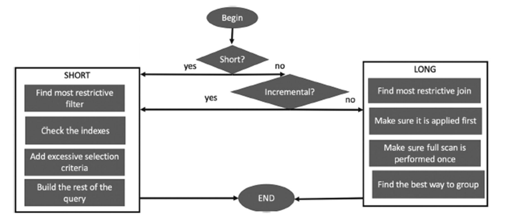
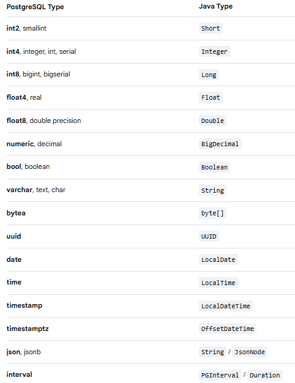

<!--
---
title: "DBA Recipes"
slug: dba-recipes
created: 2026-07-08
updated: 2026-07-08
author: admin
categories: []
tags: []
pinned: true
description: ""
---
-->

# DBA Recipes

## Table of Contents

- [Useful Docs](#useful-docs)
- [Some SQL Tricks of an Application DBA](#some-sql-tricks-of-an-application-dba)
- [Common](#common)
  - [Optimization approach by Nikolay Samokhvalov](#optimization-approach-by-nikolay-samokhvalov)
  - [Ultimate Optimization Algorithm by Henrietta Dombrovskaya, Boris Novikov, Anna Bailliekova](#ultimate-optimization-algorithm-by-henrietta-dombrovskaya-boris-novikov-anna-bailliekova)
  - [Prepared Statements and unlucky cached custom plan](#prepared-statements-and-unlucky-cached-custom-plan)
  - [Prepared Statements with Partitioned Tables (LockManager waits)](#prepared-statements-with-partitioned-tables-lockmanager-waits)
  - [Inactive Logical Replication Slot problems (catalog_xmin)](#inactive-logical-replication-slot-problems-catalog_xmin)
  - [Optimizer Statistics on partitioned tables](#optimizer-statistics-on-partitioned-tables)
  - [Optimizer Statistics problems on newly created table partition](#optimizer-statistics-problems-on-newly-created-table-partition)
  - [HASH partitioning for distributing write-load](#hash-partitioning-for-distributing-write-load)
  - [DELETE from one table affects another](#delete-from-one-table-affects-another)
  - [Consider additional abstractions in the database](#consider-additional-abstractions-in-the-database)
  - [About UUID](#about-uuid)
- [Wait Events](#wait-events)
  - [LWLock:BufferMapping](#lwlockbuffermapping)
  - [LWLock:BufferContent](#lwlockbuffercontent)
  - [LWLock:WALWrite](#lwlockwalwrite)
  - [IPC:SyncRep](#ipcsyncrep)
- [SQL Tuning Algorithm](#sql-tuning-algorithm)
  - [I. Initial Assessment / Classification](#i-initial-assessment--classification)
  - [II. Simple Query](#ii-simple-query)
  - [III. Complex Query](#iii-complex-query)
  - [IV. Tuning](#iv-tuning)
    - [1. Get Query Plan](#1-get-query-plan)
    - [2. Analyze Query Plan](#2-analyze-query-plan)
    - [3. Analyze Query Objects](#3-analyze-query-objects)
    - [4. Common Strategies](#4-common-strategies)
    - [5. Non-standard Strategies](#5-non-standard-strategies)
    - [6. Rewrite Query](#6-rewrite-query)
    - [7. Review the business logic of the query](#7-review-the-business-logic-of-the-query)
- [Issue / Fix](#issue--fix)
  - [Postgis create extension](#postgis-create-extension)
  - [EM 13.2: Database Performance -> Top Activity Page Reports JAVA.LANG.NULLPOINTEREXCEPTION](#em-132-database-performance---top-activity-page-reports-javalangnullpointerexception)

## Useful Docs

- [Some SQL Tricks of an Application DBA](https://hakibenita.com/sql-tricks-application-dba)
- [Habr PostgreSQL Antipatterns](https://habr.com/ru/companies/tensor/articles/968720/)
- [PostgreSQL Query Optimization by Henrietta Dombrovskaya, Boris Novikov, Anna Bailliekova (Apress, 2021)](https://github.com/Apress/postgresql-query-optimization)
- [PGConf - Оптимизация OLTP-нагрузки](https://pgconf.ru/talk/1620149)
- [PGConf - Инструменты диагностики и примеры оптимизации запросов](https://pgconf.ru/talk/1700782)
- [PGConf - Примеры оптимизации запросов, часть 2](https://pgconf.ru/talk/2034067)
- [PGConf - Перепланирование безнадежных запросов в реальном времени](https://pgconf.ru/talk/1622277)
- [PGConf - Дело о пропавшей производительности в PostgreSQL](https://rutube.ru/video/320c4e972c39c217d2e6eb92e3e3bd2f/?r=wd)
- [Неклассические техники оптимизации запросов в PostgreSQL](https://youtu.be/c2a5EQ_2G58)
- [PGConf - Коллапс в планах запросов. Достигаем и управляем](https://pgconf.ru/talk/1589419)

## Some SQL Tricks of an Application DBA

Source: [Some SQL Tricks of an Application DBA](https://hakibenita.com/sql-tricks-application-dba)

- [Update Only What Needs Updating](https://hakibenita.com/sql-tricks-application-dba#update-only-what-needs-updating)
- [Disable Constraints and Indexes During Bulk Loads](https://hakibenita.com/sql-tricks-application-dba#disable-constraints-and-indexes-during-bulk-loads)
- [Use UNLOGGED Tables for Intermediate Data](https://hakibenita.com/sql-tricks-application-dba#use-unlogged-tables-for-intermediate-data)
- [Implement Complete Processes Using WITH and RETURNING](https://hakibenita.com/sql-tricks-application-dba#implement-complete-processes-using-with-and-returning)
- [Avoid Indexes on Columns With Low Selectivity](https://hakibenita.com/sql-tricks-application-dba#avoid-indexes-on-columns-with-low-selectivity)
- [Use Partial Indexes](https://hakibenita.com/sql-tricks-application-dba#use-partial-indexes)
- [Always Load Sorted Data](https://hakibenita.com/sql-tricks-application-dba#always-load-sorted-data)
- [Index Columns With High Correlation Using BRIN](https://hakibenita.com/sql-tricks-application-dba#index-columns-with-high-correlation-using-brin)
- [Make Indexes "Invisible"](https://hakibenita.com/sql-tricks-application-dba#make-indexes-invisible)
- [Don't Schedule Long Running Processes at Round Hours](https://hakibenita.com/sql-tricks-application-dba#dont-schedule-long-running-processes-at-round-hours)

## Common

### Optimization approach by Nikolay Samokhvalov

Two levels of query analysis: *"micro"* and *"macro"* ([source](https://x.com/samokhvalov/status/1815927716413423988)).

**Micro level** - the analysis of a single query planning and execution. The main tool here is `EXPLAIN (ANALYZE, BUFFERS)`. Goals: understand planner's decisions, find suboptimal behavior and optimization opportunities. **Planner behavior depends on two inputs only: statistics (data volumes and distribution) and Postgres settings**. That's it. Real physical resources don't matter for the planner, it doesn't know how much RAM you have or how fast the disks are.

**Macro level** — the analysis of complex workloads, behaviors of multiple sessions, and the database system as whole, with all its components participating in query processing such as buffer pool, lock manager, checkpointer. **Tools**: pg_stat_statements, logs, wait event analysis (sampling of pg_stat_activity, ideally with something like pg_wait_sampling), pg_locks, etc.

Splitting analysis to these two levels help us understand what to do and when. And it has simple analogy: macroeconomics studying global market behavior and microeconomics studying behavior of individual actors.

Good question is how to avoid gaps in analysis/optimization workflows and transition between levels easier. This area definitely requires certain efforts, especially in larger orgs.

### Ultimate Optimization Algorithm by Henrietta Dombrovskaya, Boris Novikov, Anna Bailliekova

[Source (page 334)](https://github.com/Apress/postgresql-query-optimization)



### Prepared Statements and unlucky cached custom plan

An unfavorable custom plan may get cached (the first 5 executions), followed by a generic plan that, according to its average cost estimate, might also be suboptimal. Additionally, prepared statements (PREPARE) can interfere with the use of pgBouncer in transaction pooling mode.

Consider to change parameter [`plan_cache_mode = force_custom_plan`](https://www.postgresql.org/docs/current/runtime-config-query.html#GUC-PLAN-CACHE-MODE).

Use application level poller (like [`HikariCP`](https://github.com/brettwooldridge/HikariCP), for example) instead of pgBouncer.

### Prepared Statements with Partitioned Tables (LockManager waits)

Detailed explanation with examples is [here](https://postgres.ai/blog/20251030-postgres-marathon-2-011).

### Inactive Logical Replication Slot problems (catalog_xmin)

The root cause is that a **logical replication slot reserves catalog_xmin**, which blocks the autovacuum of the system catalog. In systems with frequent and aggressive autoanalyze, **pg_statistic begins to bloat**. As a result, **query planning degrades**.

Solution is to either remove inactive logical slots or reconsider the frequency of autoanalyze execution.

### Optimizer Statistics on partitioned tables

[Doc](https://www.postgresql.org/docs/current/sql-analyze.html) says: *"The autovacuum daemon does not process partitioned tables, nor does it process inheritance parents if only the children are ever modified. It is usually necessary to periodically run a manual ANALYZE to keep the statistics of the table hierarchy up to date."*

### Optimizer Statistics problems on newly created table partition

When a new table partition is created, query performance may be problematic for some time until it is populated with data and a proper ANALYZE is run.

The solution is either to **hint critical queries** or to **manually collect statistics** as workaround (e.g., using cron or pg_cron). It is also important to **collect statistics for the parent table** (see the previous point for the reason why).

### HASH partitioning for distributing write-load

In the case of an append-only table under very high load, you may encounter wait events like `IO:DataFileExtend` combined with [`LWLock:extend`](https://docs.aws.amazon.com/AmazonRDS/latest/AuroraUserGuide/apg-waits.lockextend.html). In such situations, it is recommended to hash-partition the table to distribute the load and minimize these wait events.

[Interesting tests](https://www.shayon.dev/post/2025/221/bypass-postgresql-catalog-overhead-with-direct-partition-hash-calculations/) about partitioning overhead.

### DELETE from one table affects another

Possible reasons:

- **Tables are linked**. For example, a foreign key exists, and we want to delete a primary key. In this case, the corresponding rows in the child table must also be deleted if a cascade was defined.
- Within a single transaction, a deletion from a small table t1 occurs first, followed by a deletion from a large table t2. **Concurrent sessions with same logic (transactions)** attempting to start a similar transaction will hang when trying to delete from t1. This happens if the deletion from t1 in the first transaction overlaps with the deletion from t1 in the parallel second transaction (for example, both try to delete rows based on the same condition like `date <= now()`).

### Consider additional abstractions in the database

Try not to limit yourself to standard methods when solving problems. For example, there is a table with a timestamp column, but the application requires it to be timestamp with time zone (for its own logic, the reason is not important here). To avoid data migration and other complexities, you can simply **create a view**. However, the optimizer might theoretically behave unpredictably, so you need to carefully analyze the consequences of such a solution (check execution plans, etc.).

How to make a **table read-only** in Postgres? You can revoke write permissions on it, but you can also create a trigger.

### About UUID

In short, due to their random nature, UUIDs can cause a large number of blocks to be read. This happens because the logical order of values in the index does not match (or correlates poorly with) the physical order in the table ([pg_stats.correlation](https://www.postgresql.org/docs/current/view-pg-stats.html)).

Details: [one](https://andyatkinson.com/avoid-uuid-version-4-primary-keys), [two](https://www.cybertec-postgresql.com/en/unexpected-downsides-of-uuid-keys-in-postgresql/), [three](https://habr.com/ru/companies/tensor/articles/989032/).

## Wait Events

### LWLock:BufferMapping

Good explanation on AWS docs [here](https://docs.aws.amazon.com/AmazonRDS/latest/UserGuide/wait-event.lwl-buffer-mapping.html).

Common reasons are:

- Query **plan changed** for some reason to a less optimal one, which leads to a greater number of block reads (for example, it switched to a different index or to a sequential scan)
- Lack of **up-to-date optimizer statistics** can prevent an index from being used, for example, **on a new partition for the current day** (this is especially problematic if auto-vacuum is disabled on partitions and the default mechanism does not work).
- **Long-running transaction or query (or queries)** is holding the database transaction horizon, preventing the autovacuum and [HOT-cleanup](https://habr.com/ru/companies/tantor/articles/916318/) from running. This can cause other queries (especially those on "queue" type tables) to read a larger number of blocks due to the presence of dead tuples, potentially leading to LWLock:BufferMapping wait events.
- **Load** on the database from the application **has increased** (the number of queries, the volume of data requested).
- Not enough `shared_buffers`. For example, there might be 10 queries that work fine, but at some point a query arrives that reads many blocks, **using an index**, which starts to flush the cache. This affects normal queries, causing them to wait on BufferMapping locks.

### LWLock:BufferContent

Good explanation on AWS docs [here](https://docs.aws.amazon.com/AmazonRDS/latest/UserGuide/wait-event.lwlockbuffercontent.html).

**Foreign key constraints** can be a reason of **[LWLock:BufferContent](https://docs.aws.amazon.com/AmazonRDS/latest/UserGuide/wait-event.lwlockbuffercontent.html)** wait events caused by integrity checks and locks mechanics in Postgres especially with partitioned tables.

### LWLock:WALWrite

[GitLab - Investigate WALWrite LWLock contention](https://gitlab.com/gitlab-com/gl-infra/observability/team/-/issues/3717)

- Someone is holding all 8 lwlock:walinsert locks for a long time. Maybe because of IO issues => IO:WALSync waits should be in place too.
- Check who is generating most WAL records. Is it normal and expected?
- Check hardware issues, which cause long IO:WALSync events (disk latency etc).
- I suppose synchronous replication (IPC:SyncRep) can also be a possible reason of sessions queue for LWLock:WALWrite lock.
- Play around with [`commit_delay`](https://gitlab.com/gitlab-com/gl-infra/observability/team/-/issues/3717) parameter.
- Play around with [`wal_sync_method`](https://www.postgresql.org/docs/8.1/runtime-config-wal.html) parameter and [`pg_test_fsync`](https://tanelpoder.com/posts/using-pg-test-fsync-for-testing-low-latency-writes/) utility.

### IPC:SyncRep

Can be observed on clusters with synchronous replication.

- Check if everything is OK with your replica (disks latency, network).
- Check who is generating most WAL records. Is it normal and expected? Replication lag?
- Are there any operations on Master which can cause huge spikes in WAL generation (vacuum, reindex, copy, etc). [Check this article.](https://ardentperf.com/2025/10/27/explaining-ipcsyncrep-postgres-sync-replication-is-not-actually-sync-replication/)

## SQL Tuning Algorithm

### I. Initial Assessment / Classification

Begin by reviewing the query from a high-level perspective and intuitively evaluating it (consider its length, complexity, number of tables involved, etc.).

Based on this initial impression, proceed with the following steps.

### II. Simple Query

If the query is "simple" and easy to understand mentally - try to describe the problem it is solving in simple terms.

Then follow the steps in the "Tuning" section.

### III. Complex Query

By "complex" I mean query with lot of tables involved, joins, sub-queries, procedure calls, complex filters, some internal logic, unions, etc.

***Key approach here is to split original query into smaller pieces and try to understand and tune each of them one by one.***

Use AI to format it and ask it to "break it down" and explain the meaning in natural language.

### IV. Tuning

#### 1. Get Query Plan

Use [`EXPLAIN`](https://www.postgresql.org/docs/current/sql-explain.html) to get the optimizer's estimation about query plan. **Note that the actual execution plan may differ from this estimate.**

For a more accurate analysis, it's better to use [`EXPLAIN (ANALYZE, BUFFERS)`](https://www.postgresql.org/docs/current/sql-explain.html). This command provides the actual execution plan along with detailed runtime statistics. However, be aware that **this command actually executes the query. So this can be dangerous for data-modifying statements (delete/update/insert).**

If you want to get actual query plan of `DELETE` statement for example, then you can use below approach:

```sql
BEGIN;
EXPLAIN (ANALYZE, BUFFERS) DELETE ...
ROLLBACK;
```

Crucial caveat - even though the transaction is rolled back, Postgres physically performs the deletion (data block changes) during the `EXPLAIN (ANALYZE, BUFFERS) DELETE ...` execution. The changes are simply not committed and are invisible to other sessions.

If you don't have an opportunity to run `EXPLAIN (ANALYZE, BUFFERS)` for some reason, maybe you have [pg_store_plans](https://ossc-db.github.io/pg_store_plans/) extension installed. If so - use it to get query plan.

As an alternative to [pg_store_plans](https://ossc-db.github.io/pg_store_plans/) you can configure the [auto_explain](https://www.postgresql.org/docs/current/auto-explain.html) module to automatically log execution plans for long-running queries.

#### 2. Analyze Query Plan

Focus on the plan nodes that:

- Consume the most **execution time**
- Perform the highest **number of buffer reads**
- Compare the **actual and estimated row** counts. A large difference between these values often leads to a suboptimal execution plan, frequently due to outdated statistics
- Planning time
- Temporary files written
- SeqScan's on large tables
- Conditions are pushed down and appear in the IndexCond
- Join order and methods

Use [Tenzor](https://explain.tensor.ru/) to visualize query plan.

#### 3. Analyze Query Objects

If your plan analysis reveals an obvious bottleneck node(s) where most of the work is done, focus on optimizing it first.

Review query objects:

- Get **list** of all tables
- Get table **DDL** (columns, indexes, partition key, partition rule, foreign keys, constraints, triggers, etc)
- Get **size** of all tables (table size, index size, toast size)
- Get info about table/index **bloat**. *This is especially useful when a plan contains an IndexOnlyScan node that performs a large number of HeapFetches. In such cases, the overhead of these fetches can make it slower than a regular IndexScan. Details are [here](https://habr.com/ru/companies/tensor/articles/751458/)*
- Get info about **last vacuum/analyze operations time**, number of dead rows and its ratio, custom vacuum/analyze settings if any
- Get **optimizer stats** ([pg_stats](https://www.postgresql.org/docs/current/view-pg-stats.html)) about columns used in query filter (`WHERE` clause) to understand selectivity of these fields.

#### 4. Common Strategies

##### ANALYZE VERBOSE

Run [`ANALYZE VERBOSE`](https://www.postgresql.org/docs/current/sql-analyze.html) on problematic tables. This is a fast operation and can be sufficient for the optimizer to choose a better plan. For partitioned tables, ensure you collect statistics not only for the specific partition but also for the parent table. Statistics are [not collected for the parent by default](https://www.postgresql.org/docs/current/sql-analyze.html), and updating them can significantly improve the optimizer's planning decisions.

##### VACUUM VERBOSE

Run [`VACUUM VERBOSE`](https://www.postgresql.org/docs/current/sql-vacuum.html) on problematic tables. This process takes longer but can be equally crucial for optimizer decisions. There are some important considerations before running:

- **WAL Generation:** If VACUUM hasn't run for a long time, then it can generate a significant volume of Write-Ahead Log (WAL). Monitor your WAL generation rates.
- **Long-running Transactions:** Check for sessions in the idle in transaction state with non-NULL backend_xid or backend_xmin values. These sessions hold back the transaction ID horizon, preventing VACUUM from reclaiming all dead tuples.
- **Table Truncation Lock:** In some cases, it may be beneficial to disable the truncation phase by setting `vacuum_truncate = off`. This prevents VACUUM from attempting to truncate the empty space at the end of the table file, which requires a brief ACCESS EXCLUSIVE lock. This lock can disrupt application operations under load.

##### Indexes for Filter Conditions (Partial Indexes / Covering Indexes / Multicolumn Indexes)

Verify that indexes exist for the columns used in the query's filter conditions (WHERE clause). Assess their effectiveness (**selectivity**) using the statistics previously gathered from pg_stats.

Ensure that all filter conditions are **pushed down** and appear in the **IndexCond** section of the EXPLAIN output. If a condition is not pushed down, the optimizer has deemed it ineffective for some reason. In such cases, you may need to try specific techniques or workarounds to improve index usage.

Sometimes you might have the correct index, but the query plan shows a full index scan repeated multiple times. For example, consider a composite index that includes a nullable status column, while your query filters for `status IS NOT NULL`. In this scenario, it might be beneficial to create a **partial index** (e.g., `CREATE INDEX ... WHERE status IS NOT NULL`).

About Covering Indexes and Index Only Scan read [here](https://www.postgresql.org/docs/current/indexes-index-only-scans.html) and [here](https://habr.com/ru/companies/tensor/articles/751458/).

About Multicolumn Indexes read [here](https://www.postgresql.org/docs/current/indexes-multicolumn.html).

##### Indexes for Join Columns

Check for the presence of indexes on the columns used to join tables (**join condition**). Additionally, evaluate the **join order** - specifically, determine which table acts as the **outer loop** (in a nested loop join) and which serves as the **inner loop**. This understanding is crucial for assessing whether the correct indexes (and join methods) are being used to drive the join efficiently.

##### Indexes for Sort/Order By Columns

Verify the existence of indexes on the columns used for sorting (`ORDER BY`).

The goal is to leverage an index scan to **retrieve data in the required order directly**, thereby eliminating a separate, costly **Sort** operation from the execution plan. When reading from an index that matches the sort order, the data is already ordered.

**However, there are important details/caveats to consider**. Let's take the following filter as an example:

```
... WHERE kind = 10 AND home = 38 ORDER BY code DESC;
```

The `code` field is not used in the filter, but it is part of the `ORDER BY` clause. If a large number of rows is selected, the optimizer may consider a separate **Sort** node in the plan to be expensive.

In this case, if a suitable index exists, the optimizer can use it to read the rows in the required sorted order directly, avoiding the sort operation.

For the example above, an index on the following columns would be appropriate:

```
(home, kind, code DESC)
```

Adding `DESC` is not strictly mandatory (the optimizer can perform a *Backward Index Scan*), but it is recommended to specify the sort direction explicitly for clarity and optimal planning.

However, the `code` column **cannot always be placed last** in the index. Sometimes, to force the use of the index for sorting, you must move it to the **first position** (or at least to a position that is **not the last**).

This is valid for cases where the condition on a preceding column (like `home`) can have multiple values. For example:

```
... WHERE kind = 10 AND home IN (38, 39) ORDER BY code DESC;
```

In this query, `home` is matched against a list of values (`IN` clause). An index on `(home, kind, code DESC)` would provide the correct order **only within each specific value of** `home`. Since we are selecting **multiple distinct values** for `home` (38 and 39), the rows for `home = 38` and `home = 39` will be read from the index in separate groups, each internally sorted by `code`. However, the **overall result set** (combining both groups) would still require a merge or a final sort to satisfy the global `ORDER BY code DESC`.

In this case, the optimizer **will NOT** be able to use an index of the form `(home, kind, code DESC)` for sorting. This is because the index would need to traverse two sub-trees (one for each value of `home`), and it is NOT guaranteed that `code` values are non-repeating within each sub-tree (unless it is the primary key or has a uniqueness constraint?). Example:

```
38-10-123
38-10-456
39-10-123 <<< *duplicate value appearing after the 456 entry means you cannot rely on the index to guarantee the correct global sort order under these conditions.*
```

To make it possible, you need following index:

```
(kind, code DESC, home)
```

If the filter contains multiple values for `kind` too:

```
... WHERE kind IN (10, 11) AND home IN (38, 39) ORDER BY code DESC;
```

In that case, it must be moved to the first position entirely:

```
(code DESC, kind, home)
```

In this case, the optimizer will likely determine that it is cheaper to read the entire index in the order specified by the `ORDER BY` clause, rather than reading all the data and then sorting it with a separate **Sort** node in the plan.

##### Indexes for Foreign Keys

If foreign key columns are not indexed, `INSERT` and `UPDATE` operations may experience slowdowns during referential integrity checks. This happens because the database needs to verify the existence of the corresponding value in the parent table, and without an index on the referenced column, this check requires a full table scan, which is inefficient.

##### Index exists but NOT being used (data types mismatch)

One of the reason may be an **incorrect data type passed from the application**. As a result, PostgreSQL has to perform an implicit type conversion and cannot utilize the index.

Below is a mapping of PostgreSQL types to Java types:



##### Partition Pruning

If the table is partitioned, verify that **partition pruning** is working and that the query filter includes the correct predicate to "drill down" into the required partition.

##### Global Indexes

If it is found that partition pruning is not working because the partition key is not provided as a predicate in the query, consider creating a **global index**. This feature is supported by some commercial PostgreSQL forks but is not yet available in the vanilla (community) version.

#### 5. Non-standard Strategies

##### Alternative Index Types

This includes not only standard B-tree indexes with additional operator classes (such as `varchar_pattern_ops` or `text_pattern_ops` for `LIKE` pattern matching) but also other specialized index types like **Hash, GIN, BRIN**, and others.

##### Functional Indexes

[Docs about indexes on expressions](https://www.postgresql.org/docs/current/indexes-expressional.html)

##### Disable Parallelism

In some situations, it has been observed that **disabling parallelism** (for example, using the hint [`/*+ Set(max_parallel_workers_per_gather 0) */`](https://pg-hint-plan.readthedocs.io/en/latest/hint_list.html)) can speed up a query on an overloaded server. This is because it avoids the overhead of forking and managing additional worker processes.

##### Disable JIT

For OLTP workload JIT should be disabled (usually). If the execution plan includes JIT (Just-In-Time) compilation, try disabling it. This can sometimes help and save resources.

More info: [one](https://postgrespro.ru/docs/postgresql/current/jit-reason), [two](https://postgrespro.ru/docs/postgresql/current/jit-decision), [three](https://habr.com/ru/companies/haulmont/articles/589775/).

##### Try to use Hints

In some cases, running `ANALYZE` or `VACUUM` does not improve the optimizer's plan (due to bugs, for example). However, if we "know" that a specific index or join method would be more efficient, we can use the [pg_hint_plan](https://pg-hint-plan.readthedocs.io/en/latest/hint_list.html) extension and its hints.

I would pay special attention to the [Set](https://pg-hint-plan.readthedocs.io/en/latest/hint_list.html) hint. It allows you to manipulate various PostgreSQL parameters, such as parallelism (as shown earlier) or enabling/disabling specific join methods (enable_hashjoin, for example) and scan types (enable_seqscan and others).

In specific cases where modifying the query with hints is not feasible (for example, due to a long application deployment cycle while an urgent fix is needed), you can use the [pg_outline](https://pangolin.sbertech.ru/center/docs/7/extensions/pg_outline) extension. This tool allows you to inject a hint into a specific query without making any changes to the application code.

##### Manual adjustment of Column Statistics

The problem often lies in the incorrect selectivity estimation of a predicate in the query. The reason is usually incorrect (unlucky) statistics on large tables, combined with the value of the `default_statistics_target` parameter. Increasing this target in OLTP systems doesn't yield significant benefits - it results in more statistics being collected (taking longer) and can also slow down the planner's work.

Solution is to analyze the actual predicate selectivity, compare it with the optimizer's estimate (`pg_stats.n_distinct`), and manually adjust it using `ALTER TABLE ... ALTER COLUMN ... SET (n_distinct = -0.05)` - for a predicate with an average uniqueness of 5% of the total rows - **followed by running ANALYZE**.

##### Extended Statistics

If you have a strong understanding that a specific **combination of columns** results in a small result set (high correlation), it's advisable to **create extended statistics** on those columns. This informs the optimizer about the correlation, as by default it simply multiplies the individual filter estimates, which can lead to a **greatly overestimated row count**. Such an overestimation can cause the optimizer to choose a less efficient execution plan.

More info [here](https://postgrespro.ru/docs/postgresql/current/sql-createstatistics) and [here](https://habr.com/ru/companies/skillfactory/articles/574078/).

##### Table Reorganisation

This is a fairly "expensive" approach, which in most cases will cause downtime. Example: partitioning, clustering based on index, data type changes, normalizing to eliminate redundant data storage or conversely - denormalization, etc.

#### 6. Rewrite Query

PostgreSQL Optimizer can be quite unpredictable, and its behavior can be affected by almost anything - even a simple reordering of columns in the `WHERE` clause, let alone in the `ORDER BY` section.

As a DBA, here are some options you can try without deeply understanding the business logic of the query:

- Add or remove the `ORDER BY` clause to force the use of a specific index or to avoid an extra **Sort** node in the plan, instead reading data directly from the index in the required sorted order.
- "Disable" index by adding some calculation like `... WHERE id + 0 = 123;`
- Split the query into two parts and combine them using `UNION ALL`.
- Try to use a **CTE** (Common Table Expression) to analyze what is being joined with what and in which order. It may be more efficient to join different tables first, as this could reduce the result set early on. For more details about [CTE](https://habr.com/ru/companies/tensor/articles/574330/), about [materialization](https://www.postgresql.org/docs/current/queries-with.html#QUERIES-WITH-CTE-MATERIALIZATION).
- Try to use **Hints** as mentioned earlier.
- Try to use **EXISTS** instead of **IN** in case of sub-queries.
- **Redundant** joins: Sometimes your query may contain "redundant" joins that can be eliminated. For example, you are joining three tables: a, b, and c. Table a is joined to b on `a.id = b.a_id`, and then b is joined to c on `b.code = c.b_code`. In other words, you reach table c through b. However, it might turn out that table a has a field that allows a direct join to table c (for example, `a.a_code = c.c_code`). In this case, you need to be confident that such a join is semantically valid and that fields from table b are not required in the final result set.
- Try to use **ANY** instead of **IN** in case of large number of parameter values passed to a query. Check [one](https://pganalyze.com/blog/5mins-postgres-performance-in-lists-vs-any-operator-bind-parameters), [two](https://blog.jooq.org/sql-in-predicate-with-in-list-or-with-array-which-is-faster/).
- In queries, you often encounter filters like `create_date >= now()` or `create_date < now()`. This is problematic for two reasons. First, if the table is partitioned, then non-deterministic function `now()` forces the planner to **acquire locks on all partitions and their indexes** during planning, which can cause contention (**LockManager** wait events). Second, with active table operations (like UPDATEs), such a filter causes significant **index fragmentation**. To mitigate this, use a specific range: `create_date BETWEEN 'xxx' AND 'yyy'`. This likely requires application changes to somehow "remember" or cache the range boundary and periodically update it (e.g., by running a query like `SELECT min(create_date) ...`). This approach compensates for index degradation over time.
- Try **COUNT(x)** or **LEFT JOIN** instead of **NOT EXISTS**.

  Original query:

  ```sql
  SELECT a.*
  FROM table_a a
  WHERE NOT EXISTS (
      SELECT 1 
      FROM table_b b 
      WHERE b.id = a.id 
        AND b.add_id = a.add_id
  );
  ```

  Alternative with LEFT JOIN:

  ```sql
  SELECT a.*
  FROM table_a a
  LEFT JOIN table_b b 
      ON a.id = b.id 
      AND a.add_id = b.add_id
  WHERE b.id IS NULL;
  ```

  Alternative with COUNT(x):

  ```sql
  SELECT a.*
  FROM table_a a
  WHERE (
      SELECT COUNT(*) 
      FROM table_b b 
      WHERE b.id = a.id 
        AND b.add_id = a.add_id
  ) = 0;
  ```

  Sometimes it can help, especially in cases where the **second condition is, for some reason, NOT pushed down** into the `IndexCond` node in the query execution plan.

- Try to use **SRF (Set Returning Functions)** instead of **VIEWs** in case of complex queries to avoid issues where predicates are not pushed down into the view.
- Try to use `string_agg` with `LIKE` instead of `WHERE id IN (SELECT ...)` with huge amount of id's.

#### 7. Review the business logic of the query

If none of the above methods have helped resolve the issue, it's time to ask: Is the exact amount of data requested by this query truly necessary? This requires in-depth work with analysts and developers. It may turn out that this information is no longer needed at all, can be obtained in another way, or can be retrieved for a shorter time period (e.g., not for the last year, but for the last month, which would significantly reduce the dataset).

## Issue / Fix

### Postgis create extension

**ISSUE:**

```
psql> CREATE EXTENSION postgis;
server closed the connection unexpectedly
        This probably means the server terminated abnormally
        before or while processing the request.
The connection to the server was lost. Attempting reset: Failed.
 
$ du -shc /pglogs/12/postgresql.log
6.9G    /pglogs/12/postgresql.log
6.9G    total
 
[3987621]:[9-1]app=,user=,db=,client=LOG:  server process (PID 4048329) was terminated by signal 9: Killed
[3987621]:[10-1]app=,user=,db=,client=DETAIL:  Failed process was running: create extension postgis;
[3987621]:[11-1]app=,user=,db=,client=LOG:  terminating any other active server processes
[3987621]:[12-1]app=,user=,db=,client=LOG:  archiver process (PID 3987631) exited with exit code 2
[3987630]:[1-1]app=,user=,db=,client=WARNING:  terminating connection because of crash of another server process
[3987630]:[2-1]app=,user=,db=,client=DETAIL:  The postmaster has commanded this server process to roll back the current transaction and exit, because another server process exited abnormally and possibly corrupted shared memory.
[3987630]:[3-1]app=,user=,db=,client=HINT:  In a moment you should be able to reconnect to the database and repeat your command.
[4050035]:[1-1]app=[unknown],user=[unknown],db=[unknown],client=[local]LOG:  connection received: host=[local]
[4050035]:[2-1]app=[unknown],user=postgres,db=postgres,client=[local]FATAL:  the database system is in recovery mode
[3987621]:[13-1]app=,user=,db=,client=LOG:  all server processes terminated; reinitializing
[4050036]:[1-1]app=,user=,db=,client=LOG:  database system was interrupted; last known up at 2022-07-13 06:33:42 MSK
[4050036]:[2-1]app=,user=,db=,client=LOG:  database system was not properly shut down; automatic recovery in progress
[4050036]:[3-1]app=,user=,db=,client=LOG:  redo starts at 0/F000028
[4050036]:[4-1]app=,user=,db=,client=LOG:  redo done at 0/11095EE8
[4050036]:[5-1]app=,user=,db=,client=LOG:  checkpoint starting: end-of-recovery immediate
[4050036]:[6-1]app=,user=,db=,client=LOG:  checkpoint complete: wrote 238 buffers (0.2%); 0 WAL file(s) added, 0 removed, 2 recycled; write=0.007 s, sync=0.008 s, total=0.026 s; sync files=80, longest=0.006 s, average=0.001 s; distance=33368 kB, estimate=33368 kB
[3987621]:[14-1]app=,user=,db=,client=LOG:  database system is ready to accept connections
```

There was huge memory consumption by a session creating the extension. Server has only 4 GB of RAM and looks like OMM killer did its job.

**FIX:**

Huge log file is because of pgaudit extension enabled and all ddl commands are logged.

```
psql> select name, setting, context from pg_settings where name like 'pgaudit.%' order by name;
            name            | setting  |  context
----------------------------+----------+-----------
 pgaudit.log                | ddl,role | superuser
 pgaudit.log_catalog        | on       | superuser
 pgaudit.log_client         | off      | superuser
 pgaudit.log_level          | log      | superuser
 pgaudit.log_parameter      | on       | superuser
 pgaudit.log_relation       | on       | superuser
 pgaudit.log_statement_once | off      | superuser
 pgaudit.role               | auditor  | superuser
(8 rows)
```

Temporary disable pgaudit logging and create postgis extension:

```sql
ALTER SYSTEM SET pgaudit.log = '';
ALTER SYSTEM SET pgaudit.log_catalog = off;
ALTER SYSTEM SET pgaudit.log_parameter = off;
ALTER SYSTEM SET pgaudit.log_relation = off;

SELECT pg_reload_conf();

CREATE EXTENSION postgis;
```

Change pgaudit parameters back:

```sql
ALTER SYSTEM SET pgaudit.log = 'ddl,role';
ALTER SYSTEM SET pgaudit.log_catalog = on;
ALTER SYSTEM SET pgaudit.log_parameter = on;
ALTER SYSTEM SET pgaudit.log_relation = on;

SELECT pg_reload_conf();
```

### EM 13.2: Database Performance -> Top Activity Page Reports JAVA.LANG.NULLPOINTEREXCEPTION

**ISSUE:**

After DB Plug-in upgrade to version 13.2.2 on OMS 13cR2 "java.lang.NullPointerException" error message come up from time to time when trying to open "Database Peformance" - "Top Activity".

Docs:

- *After Applying 13.2 OMS Bundlepatch, Getting 'Null Pointer Exception' Error On Top Activity Page (Doc ID 2241253.1).*

Reason:

- *Hitting Bug 25455462 - ERROR JAVA.LANG.NULLPOINTEREXCEPTION OEM 13c PERFORMANCE>TOP ACTIVITY*

**FIX:**

Solution:

- *For the 13.2.2.0.0 DB plugin, the fix is included in the 13.2.2.0.170930 (OMS Side System Patch 26716235) and above patch at the OMS. For details, refer to: "Note 2275361.1 : Enterprise Manager Cloud Control Database Plugin 13.2.2.0 Bundle Patch Bug List".*
- *For the 13.2.1.0.0 DB plugin, the fix is included in the 13.2.1.0.171031 (OMS Side System Patch 26955301) and above patch at the OMS. For details, refer to: "Note 2219854.1 : Enterprise Manager Cloud Control Database Plugin 13.2.1.0 Bundle Patch Bug List".*

Workaround:

```bash
>>> oracle
 
cd <OMS_HOME>/bin
./emctl set property -name oracle.sysman.db.perf.reposconn.inactivity_timeout -value "0"
./emctl set property -name oracle.sysman.db.perf.reposconn.abandoned_connection_timeout -value "0"
./emctl stop oms -all
./emctl start oms
./emctl get property -name oracle.sysman.db.perf.reposconn.inactivity_timeout
./emctl get property -name oracle.sysman.db.perf.reposconn.abandoned_connection_timeout
```

---

<p align="center"><strong><sub>DISCLAIMER</sub></strong></p>

<p align="center">
<sub>
The information presented here is intended for informational purposes only.
The author assumes no responsibility or liability for any damages resulting
from the application of the techniques described herein. Use this content at
your own risk.
<br><br>
Always create backups and test configurations thoroughly before implementing
them in live environments.
</sub>
</p>
