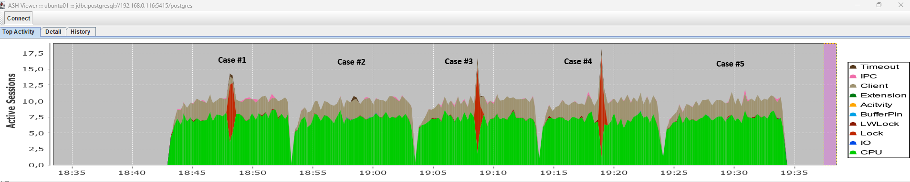

<!--
---
title: "Partition Maintenance"
slug: pg-partition-maintenance
created: 2026-07-22
updated: 2026-07-22
author: admin
categories: [postgresql]
tags: [postgresql]
pinned: false
description: "In this article, we explore different approaches to attaching and detaching partitions for partitioned tables in PostgreSQL."
---
-->

# Partition Maintenance

In this article, we explore different approaches to attaching and detaching partitions for partitioned tables in PostgreSQL.

## Table of Contents

- [Docs](#docs)
- [Test environment](#test-environment)
- [Tools](#tools)
- [Functional testing](#functional-testing)
- [Load testing](#load-testing)
- [Results](#results)
- [Limitations](#limitations)
- [Workarounds](#workarounds)
- [TODO](#todo)

## Docs

- About timeout options available in Postgres (lock_timeout, statement_timeout, idle_in_transaction_timeout, idle_session_timeout, transaction_timeout): [Postgres Timeout Explained](https://www.bytebase.com/blog/postgres-timeout/)
- A deeper explanation of the need to use lock_timeout: [Zero-downtime Postgres schema migrations need this: lock_timeout and retries](https://postgres.ai/blog/20210923-zero-downtime-postgres-schema-migrations-lock-timeout-and-retries)
- Another example on how to perform object modifications in your database with minimal downtime caused by long running locks: [How to run short ALTER TABLE without long locking concurrent queries](https://www.depesz.com/2019/09/26/how-to-run-short-alter-table-without-long-locking-concurrent-queries/)
- [PostgreSQL Partitioning Enhancements Over Versions](https://dev-aditya.medium.com/partitioning-in-postgresql-an-in-depth-guide-58e78e79a9b7)
- GitLab experience in partitioning:
  - [Database Partitioning Epic #2023](https://gitlab.com/groups/gitlab-org/-/epics/2023)
  - [Reduce locks when detaching database partitions](https://gitlab.com/gitlab-org/gitlab/-/issues/372088)
  - [Reduce database lock acquired by the partition manager](https://gitlab.com/gitlab-org/gitlab/-/issues/538988)
- Some notes about auto-partitioning:
  - [Cybertec - Automatic partition creation in PostgreSQL](https://www.cybertec-postgresql.com/en/automatic-partition-creation-in-postgresql/)
  - [Proposal: Automatic partition creation](https://www.postgresql.org/message-id/7fec3abb-c663-c0d2-8452-a46141be6d4a@postgrespro.ru)
- About partitioning of existing tables with minimal downtime: [Postgres Partition Conversion: minimal downtime](https://www.kylehailey.com/post/postgres-partition-conversion-minimal-downtime)
- About LockManager issue you can face after partitioning: [Postgres Partition Pains - LockManager Waits](https://www.kylehailey.com/post/postgres-partition-pains-lockmanager-waits)

## Test environment

**Host:**

- **Device:** ThinkPad T480 Laptop
- **CPU:** Intel(R) Core(TM) i7-8650U CPU @ 1.90GHz (2.11 GHz), 4 Cores (8 Logical Threads)
- **RAM:** 16GB
- **Disk:** SSD LITEONIT LCS-256M6S 2.5 7mm 256GB
- **OS:** Windows 11
- **Virtualization:** Oracle VirtualBox 7.2.4 r170995

**Virtual Machine:**

- **vCPU:** 4
- **RAM:** 4 GB
- **OS:** Ubuntu 24.04.2 LTS

**PostgreSQL Versions (compiled from sources):**

- 10.23
- 11.22
- 12.22
- 13.22
- 14.19
- 15.14
- 16.10
- 17.6
- 18.0

## Tools

- [pg_src_setup.sh](files/scripts/pg_src_setup.sh) - downloads and compiles the required Postgres versions.
- [test_case_attach_detach.sql](files/scripts/test_case_attach_detach.sql) - sql script containing the commands for each test case.
- [run_test.sh](files/scripts/run_test.sh) - script that runs the test for each version of Postgres.
- [Set of scripts to test each test case under load](files/scripts/load):
  - `case*.sql` - set of scripts containing SQL commands to reproduce each test case. Execution takes place within a transaction; after executing the target command, a 15-second pause is introduced to clearly demonstrate the potential issues that each approach may cause under high load.
  - [load_read.sql](files/scripts/load/load_read.sql) - script that simulates a read load.
  - [load_write.sql](files/scripts/load/load_write.sql) - script that simulates a write load.
  - [reinit.sql](files/scripts/load/reinit.sql) - script that recreates database objects before each new test case.
  - [run_load.sh](files/scripts/load/run_load.sh) - script that runs each of the test cases under load.
- [ASH Viewer](../ad-hoc/ad-hoc.md#ash-viewer) - tool for monitoring database wait events during load testing.

## Functional testing

Four tests were run on each version of Postgres:

- **Case #1:** take partition **attach** operation using:
  ```sql
  CREATE TABLE yyy PARTITION OF yyy;
  ```
- **Case #2:** take partition **attach** operations using:
  ```sql
  CREATE TABLE yyy LIKE zzz;
  ALTER TABLE xxx ATTACH PARTITION yyy;
  ```
- **Case #3:** take partition **detach** operation using:
  ```sql
  DROP TABLE yyy;
  ```
- **Case #4:** take partition **detach** operation using:
  ```sql
  ALTER TABLE xxx DETACH PARTITION yyy;
  DROP TABLE yyy;
  ```
- **Case #5:** take partition **detach** operation using:
  ```sql
  ALTER TABLE xxx DETACH PARTITION yyy CONCURRENTLY;
  DROP TABLE yyy;
  ```

The primary goal of the tests was to understand which locks would be acquired and on which objects. The main focus was on the parent table and how attach/detach procedures could impact its operation.

Test results are in table below:

| PG Version | Case #1 | Case #2 | Case #3 | Case #4 | Case #5 |
|------------|---------|---------|---------|---------|---------|
| 10.23 | <span style="color:red"><b>AccessExclusiveLock</b></span> on parent table | <span style="color:red"><b>AccessExclusiveLock</b></span> on parent table | <span style="color:red"><b>AccessExclusiveLock</b></span> on parent table | <span style="color:red"><b>AccessExclusiveLock</b></span> on parent table | <span style="color:red"><b>Not available</b></span> |
| 11.22 | <span style="color:red"><b>AccessExclusiveLock</b></span> on parent table | <span style="color:red"><b>AccessExclusiveLock</b></span> on parent table | <span style="color:red"><b>AccessExclusiveLock</b></span> on parent table | <span style="color:red"><b>AccessExclusiveLock</b></span> on parent table | <span style="color:red"><b>Not available</b></span> |
| 12.22 | <span style="color:red"><b>AccessExclusiveLock</b></span> on parent table | <b>[ShareUpdateExclusiveLock](https://www.postgresql.org/docs/current/explicit-locking.html)</b> on parent table | <span style="color:red"><b>AccessExclusiveLock</b></span> on parent table | <span style="color:red"><b>AccessExclusiveLock</b></span> on parent table | <span style="color:red"><b>Not available</b></span> |
| 13.22 | <span style="color:red"><b>AccessExclusiveLock</b></span> on parent table | <b>[ShareUpdateExclusiveLock](https://www.postgresql.org/docs/current/explicit-locking.html)</b> on parent table | <span style="color:red"><b>AccessExclusiveLock</b></span> on parent table | <span style="color:red"><b>AccessExclusiveLock</b></span> on parent table | <span style="color:red"><b>Not available</b></span> |
| 14.19 | <span style="color:red"><b>AccessExclusiveLock</b></span> on parent table | <b>[ShareUpdateExclusiveLock](https://www.postgresql.org/docs/current/explicit-locking.html)</b> on parent table | <span style="color:red"><b>AccessExclusiveLock</b></span> on parent table | <span style="color:red"><b>AccessExclusiveLock</b></span> on parent table | <b>[Available](https://www.postgresql.org/docs/current/sql-altertable.html)</b> |
| 15.14 | <span style="color:red"><b>AccessExclusiveLock</b></span> on parent table | <b>[ShareUpdateExclusiveLock](https://www.postgresql.org/docs/current/explicit-locking.html)</b> on parent table | <span style="color:red"><b>AccessExclusiveLock</b></span> on parent table | <span style="color:red"><b>AccessExclusiveLock</b></span> on parent table | <b>[Available](https://www.postgresql.org/docs/current/sql-altertable.html)</b> |
| 16.10 | <span style="color:red"><b>AccessExclusiveLock</b></span> on parent table | <b>[ShareUpdateExclusiveLock](https://www.postgresql.org/docs/current/explicit-locking.html)</b> on parent table | <span style="color:red"><b>AccessExclusiveLock</b></span> on parent table | <span style="color:red"><b>AccessExclusiveLock</b></span> on parent table | <b>[Available](https://www.postgresql.org/docs/current/sql-altertable.html)</b> |
| 17.6  | <span style="color:red"><b>AccessExclusiveLock</b></span> on parent table | <b>[ShareUpdateExclusiveLock](https://www.postgresql.org/docs/current/explicit-locking.html)</b> on parent table | <span style="color:red"><b>AccessExclusiveLock</b></span> on parent table | <span style="color:red"><b>AccessExclusiveLock</b></span> on parent table | <b>[Available](https://www.postgresql.org/docs/current/sql-altertable.html)</b> |
| 18.0  | <span style="color:red"><b>AccessExclusiveLock</b></span> on parent table | <b>[ShareUpdateExclusiveLock](https://www.postgresql.org/docs/current/explicit-locking.html)</b> on parent table | <span style="color:red"><b>AccessExclusiveLock</b></span> on parent table | <span style="color:red"><b>AccessExclusiveLock</b></span> on parent table | <b>[Available](https://www.postgresql.org/docs/current/sql-altertable.html)</b> |

## Load testing

Testing was performed on Postgres version 15.14. The results are shown in the screenshot below:



## Results

- For versions 10 and 11, there is no safe way to use the table partition Attach/Detach procedures, as the exclusive lock on the parent table will block all operations on it.
- For versions 12 and 13, there is a safe way to attach a partition using the combination of commands `CREATE TABLE yyy LIKE zzz; ALTER TABLE xxx ATTACH PARTITION yyy;`. However, there is still no safe method for performing a Detach operation under high load.
- For versions 14 and above, there is a safe method for attaching a partition using the command sequence `CREATE TABLE yyy LIKE zzz; ALTER TABLE xxx ATTACH PARTITION yyy;`. For the `DETACH` operation, the `CONCURRENTLY` option can be used; however, under high load, there is a possibility that this command may fail to acquire the required short-term lock.
- **In practice its much better to implement "hard" detach without concurrently, but with [some kind of retry logic](https://postgres.ai/blog/20210923-zero-downtime-postgres-schema-migrations-lock-timeout-and-retries)**.

## Limitations

- While versions 14 and above support non-blocking partition detachment using the `CONCURRENTLY` option, this feature cannot be used within PL/pgSQL procedures or functions:
  ```
  ERROR: ALTER TABLE ... DETACH CONCURRENTLY cannot run inside a transaction block
  ```
- ["At most one partition in a partitioned table can be pending detach at a time."](https://www.postgresql.org/docs/current/sql-altertable.html) This means that if you need to detach multiple partitions, it must be done sequentially.
- The `CONCURRENTLY` option in the `DETACH PARITION` command [cannot](https://www.postgresql.org/docs/current/sql-altertable.html) be used if a `DEFAULT` partition is defined for the parent table:
  ```
  ERROR:  cannot detach partitions concurrently when a default partition exists
  ```
- If a table has a `DEFAULT` partition, adding a new partition [can take a significant amount of time](https://www.postgresql.org/docs/current/sql-altertable.html), as PostgreSQL must verify that the data in the `DEFAULT` partition does not belong (does not satisfy the condition) to the partition you are adding.
- Global statistics are [not automatically gathered by the autovacuum process](https://www.postgresql.org/docs/current/sql-analyze.html) if changes occur only on child tables within the partitioning hierarchy. Therefore, it is periodically necessary to collect statistics manually using `ANALYZE parent_table;`.
- After creating a new partition, its statistics may not be up-to-date initially. Therefore, you either need to configure more aggressive autovacuum settings, manually collect statistics on the parent table to stabilize query plans, or use query hints (via [pg_hint_plan](https://github.com/ossc-db/pg_hint_plan)) to ensure plans are not affected by newly created partitions.

## Workarounds

- To perform regular concurrent `DETACH` operations on outdated partitions, you will need to write a script that identifies the partition (by name) matching your removal criteria and executes a `DETACH CONCURRENTLY` command separately. The easiest approach is to combine Bash and SQL with a Cron schedule. If you need to keep all the logic within the database, you can consider using [pg_cron](https://github.com/citusdata/pg_cron). In this case, the database should contain a procedure that runs regularly via pg_cron, which in turn creates another job consisting of a single `DETACH CONCURRENTLY` command.
- For versions 10 and 11, `ATTACH/DETACH` operations must be performed during periods of low activity, and you should use the `statement_timeout / lock_timeout` parameters to prevent huge lock queues. Additionally, you have to implement retry logic in case the required locks cannot be acquired.
- For versions 12 and 13, `DETACH` operations should be performed during periods of low activity. You should also use the `statement_timeout / lock_timeout` parameters to prevent huge lock queues. Additionally, you have to implement retry logic in case the required locks cannot be acquired.
- If, for some reason, a `DETACH` operation fails (e.g., due to a server crash) and a partition remains in the "detaching" state, you must use the `FINALIZE` option. It is advisable to include this check in your scripts before issuing the DETACH command. For example, if the partition's status in the [pg_inherits.inhdetachpending](https://www.postgresql.org/docs/current/catalog-pg-inherits.html) column is `TRUE`, you should add the `FINALIZE` option.

## TODO

Additional checks are required:

- with foreign keys
- with `DEFAULT` partition defined

---

<p align="center"><strong><sub>DISCLAIMER</sub></strong></p>

<p align="center">
<sub>
The information presented here is intended for informational purposes only.
The author assumes no responsibility or liability for any damages resulting
from the application of the techniques described herein. Use this content at
your own risk.
<br><br>
Always create backups and test configurations thoroughly before implementing
them in live environments.
</sub>
</p>
