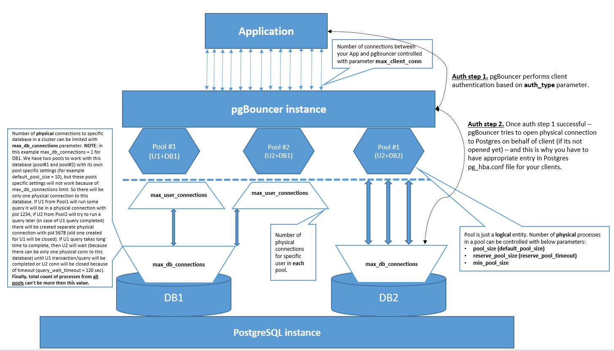

<!--
---
title: "pgBouncer Mechanics Overview"
slug: pgbouncer-mechanics
created: 2026-07-20
updated: 2026-07-20
author: admin
categories: [postgresql, archive]
tags: [postgresql, pgbouncer, pooling]
pinned: false
description: "Обзор механики работы pgBouncer: установка, аутентификация, TLS, логирование, мониторинг и решение типовых проблем."
---
-->

# pgBouncer Mechanics Overview

> **ARCHIVED CONTENT**
> The information in this post may no longer be accurate. Always refer to the latest official documentation for current best practices and features.

## Table of Contents

- [Docs](#docs)
- [Mechanics](#mechanics)
- [Installation](#installation)
    - [Default](#default)
    - [Secure](#secure)
- [Log rotation](#log-rotation)
- [Monitoring](#monitoring)
- [About prepared statements](#about-prepared-statements)
- [About multiple pgBouncer instances (so_reuseport)](#about-multiple-pgbouncer-instances-so_reuseport)
- [Issue / Fix](#issue-fix)

## Docs

- [pgBouncer documentation](https://www.pgbouncer.org/)
- [GitHub Issue #808: Connecting to PostgreSQL using a TLS certificate](https://github.com/pgbouncer/pgbouncer/issues/808)
- [GitHub Issue #982: Trouble with cert authentication over the pgBouncer all together with pg_ident.conf](https://github.com/pgbouncer/pgbouncer/issues/982)
- [GitHub Issue #845: Support of prepared statements](https://github.com/pgbouncer/pgbouncer/pull/845)
- [Prepared Statements in Transaction Mode for PgBouncer](https://www.crunchydata.com/blog/prepared-statements-in-transaction-mode-for-pgbouncer)
- GitHub Issues: Explanation about why pgbouncer auth_user can't be placed in userlist.txt with SCRAM password hash - [one](https://github.com/pgbouncer/pgbouncer/issues/774), [two](https://github.com/pgbouncer/pgbouncer/issues/981)
- [GitHub Issue #315: auth_dbname option for database definitions](https://github.com/pgbouncer/pgbouncer/pull/315)
- [GitHub Issue #110: New server_reset_query_always default introduces non-deterministic behavior.](https://github.com/pgbouncer/pgbouncer/issues/110)
- [YouTube - PgBouncer и 20000 транзакций в секунду на одной машине… Виктор Ягофаров (Avito)](https://www.youtube.com/watch?v=V57041oM9zE)
- [YouTube - Postgres Professional - DEV2-12. 07. Пул соединений](https://www.youtube.com/watch?v=r3jBnu-j_8E)
- [EDB Blog: pgbouncer auth_query and auth_user pro tips](https://www.enterprisedb.com/postgres-tutorials/pgbouncer-authquery-and-authuser-pro-tips)
- [EDB Blog: PG Phriday: Securing PgBouncer](https://www.2ndquadrant.com/en/blog/pg-phriday-securing-pgbouncer/)
- [EDB Blog: PgBouncer Logs Rotation in Linux and Windows Tutorial](https://www.enterprisedb.com/postgres-tutorials/pgbouncer-logs-rotation-linux-and-windows-tutorial)


## Mechanics




## Installation

### Default

Install packages:

```
>>> admin
 
$ sudo dnf install -y pgbouncer.x86_64 pgbouncer-debuginfo.x86_64
 
$ sudo dnf list installed | grep -i pgbouncer
pgbouncer.x86_64                            1.21.0-42PGDG.rhel8                               @pgdg-common
pgbouncer-debuginfo.x86_64                  1.21.0-42PGDG.rhel8                               @pgdg-common
pgbouncer-debugsource.x86_64                1.21.0-42PGDG.rhel8                               @pgdg-common
 
$ which pgbouncer
/usr/bin/pgbouncer
 
$ sudo /usr/bin/pgbouncer -V
PgBouncer 1.21.0
libevent 2.1.8-stable
adns: evdns2
tls: OpenSSL 1.1.1k  FIPS 25 Mar 2021
systemd: yes
```

Create pgbouncer technical account in PostgreSQL:

```
psql> SHOW password_encryption ;
 
 password_encryption
---------------------
 scram-sha-256
(1 row)
 
psql> SET password_encryption = md5;
 
psql> CREATE USER pgbouncer WITH PASSWORD '******';
 
psql> ALTER USER pgbouncer SET password_encryption = 'md5';
 
psql> ALTER USER pgbouncer SET default_transaction_read_only = on;
 
psql> SELECT usename, passwd FROM pg_shadow WHERE usename = 'pgbouncer';
 
  usename  |               passwd
-----------+-------------------------------------
 pgbouncer | md43f70fd44ef58741c726936077e8b38dd
(1 row)
```

> **NOTE:** pgbouncer database account can't have a SCRAM hashed password in userlist.txt. [Here](https://github.com/pgbouncer/pgbouncer/issues/774) and [here](https://github.com/pgbouncer/pgbouncer/issues/981) is explained why.

Update `userlist.txt` file:

```
$ echo '"pgbouncer" "md43f70fd44ef58741c726936077e8b38dd"' > /etc/pgbouncer/userlist.txt
```

Compile "user_lookup" function in database:

```
psql> CREATE OR REPLACE FUNCTION user_lookup(in i_username text, out uname text, out phash text)
RETURNS record AS $$
BEGIN
    SELECT pgs.usename, pgs.passwd 
    FROM pg_catalog.pg_shadow pgs, pg_catalog.pg_roles pgr 
    WHERE pgs.usename = pgr.rolname 
    AND NOT pgr.rolsuper
    AND pgs.usename = i_username INTO uname, phash;
    RETURN;
END;
$$ LANGUAGE plpgsql SECURITY DEFINER;
 
psql> REVOKE ALL ON FUNCTION user_lookup(text) FROM public;
 
psql> GRANT EXECUTE ON FUNCTION user_lookup(text) TO pgbouncer;
 
psql> \df *lookup*
                                        List of functions
 Schema |    Name     | Result data type |               Argument data types               | Type
--------+-------------+------------------+-------------------------------------------------+------
 public | user_lookup | record           | i_username text, OUT uname text, OUT phash text | func
(1 row)
 
psql> select * from user_lookup('pgbouncer');
 
   uname   |                phash
-----------+-------------------------------------
 pgbouncer | md43f70fd44ef58741c726936077e8b38dd
(1 row)
```

> **NOTE:** before pgBouncer version 1.19.0 you have to compile this function in each database of the cluster. But [starting with v1.19.0](https://www.pgbouncer.org/changelog.html#:~:text=Add%20auth_dbname%20option%2C%20which%20specifies%20against%20which%20database%20to%20run%20the%20auth_query.%20(%23764)) you can use [auth_dbname](https://www.pgbouncer.org/config.html#:~:text=WHERE%20usename%3D%241-,auth_dbname,-Database%20name%20in) parameter and compile this function only once.

Update "pg_hba.conf":

```
$ cat $PGDATA/pg_hba.conf
 
#TYPE        DATABASE     USER          ADDRESS          METHOD           OPTIONS
local        all          postgres                       peer
host         postgres     pgbouncer     10.128.0.29/32   md5
host         all          all           10.128.0.0/24    scram-sha-256
```

Update pgbouncer systemd service config:

```
$ cat /usr/lib/systemd/system/pgbouncer.service
 
[Unit]
Description=connection pooler for PostgreSQL
Documentation=man:pgbouncer(1)
Documentation=https://www.pgbouncer.org/
After=network.target
 
[Service]
Type=notify
User=postgres
ExecStart=/usr/bin/pgbouncer /etc/pgbouncer/pgbouncer.ini
ExecReload=/bin/kill -HUP $MAINPID
KillSignal=SIGINT
LimitNOFILE=65536
TimeoutSec=300
 
[Install]
WantedBy=multi-user.target
```

Update `pgbouncer.ini`:

```
$ mkdir -p /u01/pg13/logs/infra-01
 
$ chmod 700 /etc/pgbouncer/userlist.txt
 
$ cat /etc/pgbouncer/pgbouncer.ini
 
###########
[databases]
###########
 
* = host=infra-01.ru-central1.internal port=15432
 
###########
[pgbouncer]
###########
 
### Generic ###
 
logfile                   = /u01/pg13/logs/infra-01/pgbouncer.log
pidfile                   = /u01/pg13/logs/infra-01/pgbouncer.pid
listen_addr               = *
listen_port               = 6432
unix_socket_dir           = /tmp
ignore_startup_parameters = extra_float_digits
application_name_add_host = 1
 
### Pools ###
 
pool_mode            = transaction
max_client_conn      = 4000
max_db_connections   = 31
default_pool_size    = 30
min_pool_size        = 5
reserve_pool_size    = 1
reserve_pool_timeout = 1
 
### Authentication ###
 
auth_user     = pgbouncer
auth_type     = scram-sha-256
auth_file     = /etc/pgbouncer/userlist.txt
auth_query    = SELECT uname, phash FROM user_lookup($1)
 
### Console ###
 
admin_users = pgbouncer
stats_users = stats, pgbouncer
 
### Logging ###
 
log_connections    = 1
log_disconnections = 1
log_pooler_errors  = 1
log_stats          = 1
stats_period       = 60
verbose            = 0
 
### Network ###
 
pkt_buf       = 8192
tcp_keepalive = 1
tcp_keepcnt   = 6
tcp_keepidle  = 120
tcp_keepintvl = 10
 
 
$ chmod 700 /etc/pgbouncer/pgbouncer.ini
```

> **NOTE:** pool size in config above is for 4 users and 4 databases where each user will access its own db only (i.e. 4 pools in total). Correct this section in case of other estimates about you users/databases count. PostgreSQL max_connections parameter is set to 150.

(OPTIONAL) Add sudoers rule:

```
>>> admin
 
$ sudo visudo -f /etc/sudoers.d/pgbouncer
+++++
postgres ALL=(ALL) NOPASSWD: /bin/systemctl status pgbouncer, /bin/systemctl start pgbouncer, /bin/systemctl stop pgbouncer, /bin/systemctl restart pgbouncer, /bin/systemctl enable pgbouncer, /bin/systemctl disable pgbouncer, /bin/systemctl reload pgbouncer, /bin/systemctl daemon-reload, /bin/journalctl -u pgbouncer, /bin/journalctl -u pgbouncer *
+++++
```

Start pgBouncer service:

```
>>> postgres
 
$ sudo systemctl daemon-reload
 
$ sudo systemctl start pgbouncer
 
$ sudo systemctl enable pgbouncer
 
$ sudo systemctl status pgbouncer -l --no-pager
```

Test connection:

```
psql> CREATE USER test_usr;
 
psql> CREATE DATABASE test_db;
 
$ psql -h $HOSTNAME -p 6432 -d test_db -U test_usr
```

### Secure

Stop pgBouncer service:

```
$ sudo systemctl stop pgbouncer
```

Create certificate for pgBouncer:

```
>>> postgres
 
$ {
mkdir -p /u01/pg13/ssl
export USER_NAME="pgbouncer"
openssl req -new -nodes -out /u01/pg13/ssl/${USER_NAME}.csr -keyout /u01/pg13/ssl/${USER_NAME}.key -subj "/CN=${USER_NAME}" -config /etc/pki/tls/openssl.cnf
openssl x509 -req -in /u01/pg13/ssl/${USER_NAME}.csr -days 1825 -CA /u01/pg13/ssl/root.crt -CAkey /u01/pg13/ssl/root.key -CAcreateserial -out /u01/pg13/ssl/${USER_NAME}.crt
openssl x509 -in /u01/pg13/ssl/${USER_NAME}.crt -text -noout > /u01/pg13/ssl/${USER_NAME}.info
chmod 700 /u01/pg13/ssl/ && chmod 600 /u01/pg13/ssl/*.key && rm -f /u01/pg13/ssl/*.srl /u01/pg13/ssl/*.csr
unset USER_NAME
}
```

> **NOTE:** I've used self signed certificate in above example. In real life you have to generate csr and sign it with your trusted CA.

> **NOTE:** Postgres instance have to be configured with `ssl = on`. This is not discussed within the scope of this article.

Update `pg_hba.conf`:

```
>>> postgres
 
$ cat $PGDATA/pg_hba.conf
 
#TYPE        DATABASE     USER          ADDRESS          METHOD           OPTIONS
local        all          postgres                       peer
hostssl      postgres     pgbouncer     10.128.0.29/32   cert
hostssl      test_db      test_usr      10.128.0.0/24    cert             map=test
```

Update `pg_ident.conf`:

```
>>> postgres

$ cat $PGDATA/pg_ident.conf
 
# MAPNAME       SYSTEM-USERNAME         PG-USERNAME
test            pgbouncer               test_usr
```

> **NOTE:** we have to use `pg_ident.conf` because otherwise we will get *"LOG: provided user name (test_usr) and authenticated user name (pgbouncer) do not match"* error message. The reason is because pgBouncer uses its own certificate to open physical connection on behalf of client name. Workaround is to use `pg_ident.conf`. Some details are [here.](https://github.com/pgbouncer/pgbouncer/issues/808#:~:text=to%20set%20up-,pg_ident.conf,-from%20Postgres%20in)

Reload PostgreSQL:

```
$ pg_ctl -D $PGDATA reload
```

Update `pgbouncer.ini` and remove `userlist.txt`:

```
$ cp /etc/pgbouncer/pgbouncer.ini /etc/pgbouncer/pgbouncer.ini_BKP_NO_TLS
 
$ rm -f /etc/pgbouncer/userlist.txt
 
$ cat /etc/pgbouncer/pgbouncer.ini
 
###########
[databases]
###########
 
* = host=infra-01.ru-central1.internal port=15432
 
###########
[pgbouncer]
###########
 
### Generic ###
 
logfile                   = /u01/pg13/logs/infra-01/pgbouncer.log
pidfile                   = /u01/pg13/logs/infra-01/pgbouncer.pid
listen_addr               = *
listen_port               = 6432
unix_socket_dir           = /tmp
ignore_startup_parameters = extra_float_digits
application_name_add_host = 1
 
### Pools ###
 
pool_mode            = transaction
max_client_conn      = 4000
max_db_connections   = 31
default_pool_size    = 30
min_pool_size        = 5
reserve_pool_size    = 1
reserve_pool_timeout = 1
 
### Authentication ###
 
auth_type     = cert
auth_user     = pgbouncer
auth_dbname   = postgres
auth_query    = SELECT uname, phash FROM user_lookup($1)
 
### TLS ###
 
## Client to pgBouncer
client_tls_sslmode   = verify-full
client_tls_ca_file   = /u01/pg13/ssl/root.crt
client_tls_cert_file = /u01/pg13/ssl/infra-01.ru-central1.internal.crt
client_tls_key_file  = /u01/pg13/ssl/infra-01.ru-central1.internal.key
client_tls_protocols = all
 
## pgBouncer to PostgreSQL
server_tls_sslmode   = verify-full
server_tls_ca_file   = /u01/pg13/ssl/root.crt
server_tls_cert_file = /u01/pg13/ssl/pgbouncer.crt
server_tls_key_file  = /u01/pg13/ssl/pgbouncer.key
server_tls_protocols = secure
 
### Console ###
 
admin_users = pgbouncer
stats_users = stats, pgbouncer
 
### Logging ###
 
log_connections    = 1
log_disconnections = 1
log_pooler_errors  = 1
log_stats          = 1
stats_period       = 60
verbose            = 0
 
### Network ###
 
pkt_buf       = 8192
tcp_keepalive = 1
tcp_keepcnt   = 6
tcp_keepidle  = 120
tcp_keepintvl = 10
```

Start pgBouncer service:

```
$ sudo systemctl start pgbouncer
 
$ sudo systemctl status pgbouncer -l --no-pager
```

Test connection:

```
psql> CREATE USER test_usr;
 
psql> CREATE DATABASE test_db;
 
$ psql "postgresql://test_usr@$(hostname -f):6432/test_db?sslmode=verify-full&sslrootcert=/u01/pg13/ssl/root.crt&sslcert=/u01/pg13/ssl/test_usr.crt&sslkey=/u01/pg13/ssl/test_usr.key"
 
psql>  SELECT pgsa.datname, pgsa.pid, pgsa.application_name, pgsa.client_addr, pgsa.usename, pgssl.ssl, pgssl.version, pgssl.client_dn
FROM pg_stat_ssl pgssl
JOIN pg_stat_activity pgsa
ON pgssl.pid = pgsa.pid
WHERE pgsa.usename = 'test_usr';
 
 datname  |  pid  |     application_name     | client_addr |  usename  | ssl | version |   client_dn
----------+-------+--------------------------+-------------+-----------+-----+---------+---------------
  test_db | 18773 |                          | 10.128.0.29 | test_usr | t   | TLSv1.3 | /CN=pgbouncer
  test_db | 18775 |                          | 10.128.0.29 | test_usr | t   | TLSv1.3 | /CN=pgbouncer
  test_db | 18776 |                          | 10.128.0.29 | test_usr | t   | TLSv1.3 | /CN=pgbouncer
  test_db | 18777 |                          | 10.128.0.29 | test_usr | t   | TLSv1.3 | /CN=pgbouncer
  test_db | 18778 | psql - 10.128.0.29:55932 | 10.128.0.29 | test_usr | t   | TLSv1.3 | /CN=pgbouncer
(5 rows)
```


## Log rotation

Check if "logrotate" utility is installed:

```
>>> admin
 
$ sudo dnf list installed | grep -i logrotate
logrotate.x86_64
```

Create config for pgBouncer:

```
>>> admin
 
$ sudo grep -i include /etc/logrotate.conf
include /etc/logrotate.d
 
$ sudo view /etc/logrotate.d/pgbouncer.conf
 
/u01/pg13/logs/infra-01/pgbouncer.log {
    su postgres postgres
    rotate 14
    missingok
    sharedscripts
    notifempty
    compress
    maxsize 100M
    daily
    create 644 postgres postgres
    postrotate
         systemctl reload pgbouncer
    endscript
}
```

Check setup:

```
>>> admin
 
$ sudo logrotate -d /etc/logrotate.d/pgbouncer.conf
 
WARNING: logrotate in debug mode does nothing except printing debug messages!  Consider using verbose mode (-v) instead if this is not what you want.
 
reading config file /etc/logrotate.d/pgbouncer.conf
Reading state from file: /var/lib/logrotate/logrotate.status
Allocating hash table for state file, size 64 entries
Creating new state
Creating new state
Creating new state
...
 
Handling 1 logs
 
rotating pattern: /u01/pg13/logs/infra-01/pgbouncer.log  after 1 days (14 rotations)
empty log files are not rotated, log files >= 104857600 are rotated earlier, old logs are removed
switching euid to 1001 and egid to 1001
considering log /u01/pg13/logs/infra-01/pgbouncer.log
Creating new state
  Now: 2023-11-21 16:54
  Last rotated at 2023-11-21 16:00
  log does not need rotating (log has been already rotated)
not running postrotate script, since no logs were rotated
switching euid to 0 and egid to 0
```


## Monitoring

- [USE, RED, PgBouncer, его настройки и мониторинг](https://habr.com/ru/companies/okmeter/articles/420429/)
- [PgBouncer monitoring with okmeter](https://okmeter.io/i/integrations/pgbouncer-monitoring)
- [Zabbix PgBouncer monitoring template (by Lelik13a)](https://github.com/Lelik13a/Zabbix-PgBouncer)
- [Zabbix PgBouncer monitoring template (by lesovsky)](https://github.com/lesovsky/zabbix-extensions/blob/master/files/pgbouncer/pgbouncer-extended-template.xml)
- [PgBouncer exporter](https://github.com/prometheus-community/pgbouncer_exporter)
- [Grafana Dashboard for PgBouncer](https://grafana.com/grafana/dashboards/14022-pgbouncer/)


## About prepared statements

- [Prepared Statements in Transaction Mode for PgBouncer](https://www.crunchydata.com/blog/prepared-statements-in-transaction-mode-for-pgbouncer)
- [Prepared statements support](https://github.com/pgbouncer/pgbouncer/pull/845)


## About multiple pgBouncer instances (so_reuseport)

- [Postgres at Scale: Running Multiple PgBouncers](https://www.crunchydata.com/blog/postgres-at-scale-running-multiple-pgbouncers#coda)
- [test: pgbouncer so_reuseport (Running multiple PgBouncer instances with systemd)](https://gitlab.com/postgres-ai/postgresql-consulting/tests-and-benchmarks/-/issues/5)


## Issue / Fix

### Issue #1

```
$ psql -h $HOSTNAME -p 6432 -d postgres -U zabbix_usr
Password for user zabbix_usr:
psql (12.11)
Type "help" for help.
 
zabbix_usr@postgres=> \q
 
$ psql -h $HOSTNAME -p 6432 -d zabbix_db -U zabbix_usr
psql: error: FATAL:  bouncer config error
```

### Fix #1

Usually above error appears when **pgBouncer can't perform authentication on its side**. Check pgBouncer log file for details. In this case old pgBouncer version was in use and "user_lookup" function should be created in each database of the cluster.

```
zabbix_db> CREATE OR REPLACE FUNCTION user_lookup(in i_username text, out uname text, out phash text)
RETURNS record AS $$
BEGIN
    SELECT pgs.usename, pgs.passwd 
    FROM pg_catalog.pg_shadow pgs, pg_catalog.pg_roles pgr 
    WHERE pgs.usename = pgr.rolname 
    AND NOT pgr.rolsuper
    AND pgs.usename = i_username INTO uname, phash;
    RETURN;
END;
$$ LANGUAGE plpgsql SECURITY DEFINER;
 
psql> REVOKE ALL ON FUNCTION user_lookup(text) FROM public;
 
psql> GRANT EXECUTE ON FUNCTION user_lookup(text) TO pgbouncer;
```

### Issue #2

```
psql -h $HOSTNAME -p 6432 -U zbx_monitor pgbouncer
Password for user zbx_monitor:
psql: error: FATAL:  password authentication failed
```

### Fix #2

In this case we tried to connect to internal pgBouncer "database" as zbx_monitor user with no luck. Fix depends on your pgBouncer settings, but in most cases `userlist.txt` file is in use for technical accounts, thus we have to add zbx_monitor user password hash into `userlist.txt` file or use "unix_socket_dir" parameter value as host to connect.

```
view /etc/pgbouncer/userlist.txt
+++++
"pgbouncer" "md5e09p1636e7843d239c2b1637f1fd73aa"
"zbx_monitor" "md56e1rt95f11725d24fe01da7873045cebf"    <--- added
+++++
 
$ psql -h /tmp -p 6432 -d pgbouncer -U pgbouncer -c "reload;"
```

### Issue #3

```
psql -h $HOSTNAME -p 6432 -U zbx_monitor pgbouncer
psql: error: FATAL:  not allowed
```

### Fix #3

Need to add "zbx_monitor" user into "stats_users" parameter of `pgbouncer.ini` config file.

```
view /etc/pgbouncer/pgbouncer.ini
+++++
...
...
...
stats_users = pgbouncer, zbx_monitor    <----- added zbx_monitor
...
...
...
+++++
 
psql -h /tmp -p 6432 -d pgbouncer -U pgbouncer -c "reload;"
```

### Issue #4

```
$ psql -h $HOSTNAME -p 6432 -d postgres -U user1   <--- stuck
 
>>> pgbouncer.log:
 
ERROR S-0x560dacae14c0: postgres/pgbouncer@10.128.0.29:15432 cannot do SCRAM authentication: password is SCRAM secret but client authentication did not provide SCRAM keys
ERROR S-0x560dacae14c0: postgres/pgbouncer@10.128.0.29:15432 cannot do SCRAM authentication: password is SCRAM secret but client authentication did not provide SCRAM keys
ERROR S-0x560dacae14c0: postgres/pgbouncer@10.128.0.29:15432 cannot do SCRAM authentication: password is SCRAM secret but client authentication did not provide SCRAM keys
```

### Fix #4

SCRAM is not supported for auth_user. You have to set md5 method for auth_user so pgBouncer can login into cluster databases for checking client credentials. Details: [one](https://github.com/pgbouncer/pgbouncer/issues/774), [two](https://github.com/pgbouncer/pgbouncer/issues/508), [three](https://stackoverflow.com/questions/69473519/pgbouncer-and-scram-sha-256-setup).

> **NOTE:** for clients `auth_method = scram-sha-256` can be used with no issues. The above issue relates only to auth_user.

```
postgres@postgres=# select rolname, rolpassword from pg_authid where rolname = 'pgbouncer';
  rolname  |                                                              rolpassword
-----------+---------------------------------------------------------------------------------------------------------------------------------------
 pgbouncer | SCRAM-SHA-256$4096:PY+WyQUQol4dh8EeVnX3xg==$sarb8hfCKqR5NlgQdk8r7KW1xkxjI7SX1gwg7ZDZ6pc=:M456v1DHboEIhgjQ5oLo7Tt7nYzjEZVkDZKdCfmRMNE=
(1 row)
 
postgres@postgres=# show password_encryption ;
 password_encryption
---------------------
 scram-sha-256
(1 row)
 
postgres@postgres=# set password_encryption = md5;
SET
postgres@postgres=# alter user pgbouncer set password_encryption = 'md5';
ALTER ROLE
postgres@postgres=# alter user pgbouncer with password '******';
ALTER ROLE
postgres@postgres=# select rolname, rolpassword from pg_authid where rolname = 'pgbouncer';
  rolname  |             rolpassword
-----------+-------------------------------------
 pgbouncer | md57f70fd55ef35799c726936077e8b38dd
(1 row)
 
postgres@postgres=# \q
 
 
$ echo '"pgbouncer" "md57f70fd55ef35799c726936077e8b38dd"' > /etc/pgbouncer/userlist.txt
```

> **NOTE:** there should be a rule in `pg_hba.conf` with `md5` auth mehod for `auth_user` too, otherwise client connection will stuck again because if pgBouncer is not be able to check user credentias in database cluster (in case of `auth_query` in use instead of `userlist.txt`).

---

<p align="center"><strong><sub>DISCLAIMER</sub></strong></p>

<p align="center">
<sub>
The information presented here is intended for informational purposes only.
The author assumes no responsibility or liability for any damages resulting
from the application of the techniques described herein. Use this content at
your own risk.
<br><br>
Always create backups and test configurations thoroughly before implementing
them in live environments.
</sub>
</p>
