<!--
---
title: "PostgreSQL Synchronous Commit Effects"
slug: postgresql-synch-commit-effects
created: 2026-07-17
updated: 2026-07-17
author: admin
categories: [postgresql, theory-and-experiments, archive]
tags: [postgresql, performance, benchmark]
pinned: false
description: "Benchmark results comparing PostgreSQL performance with synchronous_commit = on vs off."
---
-->

# PostgreSQL Synchronous Commit Effects

> **ARCHIVED CONTENT**
> The information in this post may no longer be accurate. Always refer to the latest official documentation for current best practices and features.

## Table of Contents

- [Docs](#docs)
- [DB1](#db1)
    - [Test #1: synchronous_commit = on](#test-1-synchronous_commit-on)
    - [Test #2: synchronous_commit = off](#test-2-synchronous_commit-off)
- [DB2](#db2)
    - [Test #3: synchronous_commit = on](#test-3-synchronous_commit-on)
    - [Test #4: synchronous_commit = off](#test-4-synchronous_commit-off)
- [Summary](#summary)
- [About Data Loss](#about-data-loss)

## Docs

- [PostgreSQL synchronous_commit options and Synchronous Standby Replication](https://www.percona.com/blog/2020/08/21/postgresql-synchronous_commit-options-and-synchronous-standby-replication/)
- [Write Ahead Logging — WAL](https://www.interdb.jp/pg/pgsql09.html)


## DB1

```
postgres@bench_db=# \l+ bench_db
                                                  List of databases
   Name   |   Owner   | Encoding |   Collate   |    Ctype    | Access privileges |  Size   | Tablespace | Description
----------+-----------+----------+-------------+-------------+-------------------+---------+------------+-------------
 bench_db | bench_usr | UTF8     | en_US.UTF-8 | en_US.UTF-8 |                   | 7485 MB | data_tbs   |
(1 row)
 
postgres@bench_db=# \dt+ pgbench_*
                           List of relations
 Schema |       Name       | Type  |   Owner   |  Size   | Description
--------+------------------+-------+-----------+---------+-------------
 public | pgbench_accounts | table | bench_usr | 6405 MB |
 public | pgbench_branches | table | bench_usr | 56 kB   |
 public | pgbench_history  | table | bench_usr | 0 bytes |
 public | pgbench_tellers  | table | bench_usr | 256 kB  |
(4 rows)
 
postgres@bench_db=# \i table_bloat_check.sql
 databasename | schemaname |    tablename     | can_estimate | est_rows | pct_bloat | mb_bloat | table_mb
--------------+------------+------------------+--------------+----------+-----------+----------+----------
 bench_db     | public     | pgbench_history  | f            |        0 |           |          |    0.000
 bench_db     | public     | pgbench_accounts | t            | 50000000 |         1 |    94.04 | 6403.695
 bench_db     | public     | pgbench_branches | t            |      500 |         0 |     0.00 |    0.023
 bench_db     | public     | pgbench_tellers  | t            |     5000 |         0 |     0.00 |    0.219
(4 rows)
 
postgres@bench_db=# \i index_bloat_check.sql
 database_name | schema_name |    table_name    |      index_name       | bloat_pct | bloat_mb | index_mb | table_mb | index_scans
---------------+-------------+------------------+-----------------------+-----------+----------+----------+----------+-------------
 bench_db      | public      | pgbench_branches | pgbench_branches_pkey |        25 |        0 |    0.031 |    0.023 |           0
 bench_db      | public      | pgbench_tellers  | pgbench_tellers_pkey  |        13 |        0 |    0.125 |    0.219 |           0
 bench_db      | public      | pgbench_accounts | pgbench_accounts_pkey |        11 |      115 | 1071.086 | 6403.695 |           0
(3 rows)   
```

### Test #1: synchronous_commit = on

```
pgbench -h /tmp -p 5432 -c 30 -j 6 -P 60 -T 900 --no-vacuum bench_db
 
progress: 60.0 s, 1897.2 tps, lat 15.790 ms stddev 9.803
progress: 120.0 s, 1779.3 tps, lat 16.775 ms stddev 37.330
progress: 180.0 s, 1040.9 tps, lat 28.921 ms stddev 31.144
progress: 240.0 s, 1314.0 tps, lat 22.839 ms stddev 26.320
progress: 300.0 s, 1224.2 tps, lat 24.348 ms stddev 40.110
progress: 360.0 s, 1234.2 tps, lat 24.453 ms stddev 23.195
progress: 420.0 s, 1413.4 tps, lat 21.220 ms stddev 18.484
progress: 480.0 s, 1274.5 tps, lat 23.527 ms stddev 35.931
progress: 540.0 s, 1320.0 tps, lat 22.723 ms stddev 21.668
progress: 600.0 s, 1394.4 tps, lat 21.508 ms stddev 23.690
progress: 660.0 s, 1213.3 tps, lat 24.711 ms stddev 39.795
progress: 720.0 s, 1419.6 tps, lat 21.128 ms stddev 31.971
progress: 780.0 s, 1378.9 tps, lat 21.743 ms stddev 28.420
progress: 840.0 s, 1218.9 tps, lat 24.601 ms stddev 35.285
progress: 900.0 s, 1538.2 tps, lat 19.503 ms stddev 17.747
transaction type: <builtin: TPC-B (sort of)>
scaling factor: 500
query mode: simple
number of clients: 30
number of threads: 6
duration: 900 s
number of transactions actually processed: 1239686
latency average = 21.771 ms
latency stddev = 29.064 ms
tps = 1377.205277 (including connections establishing)
tps = 1377.222087 (excluding connections establishing
```

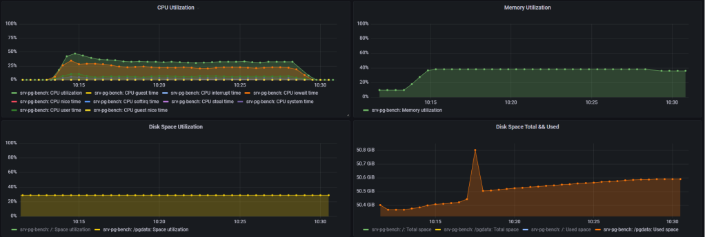
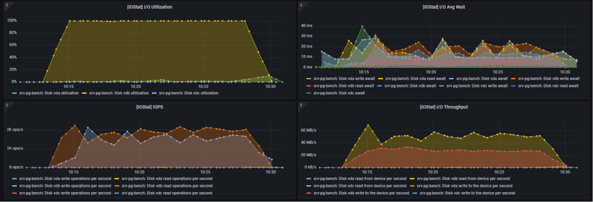
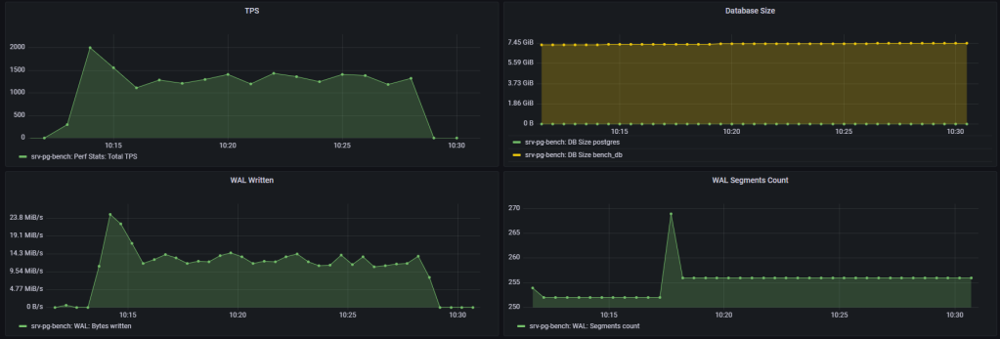
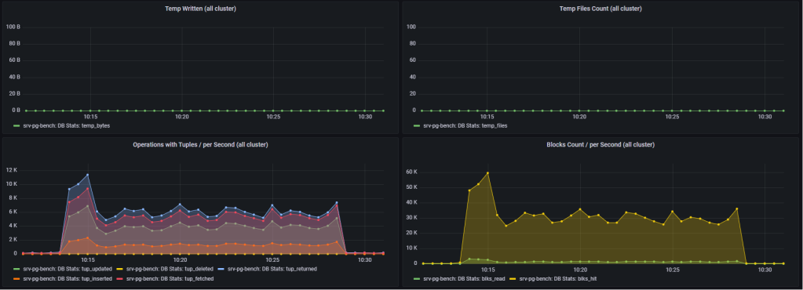
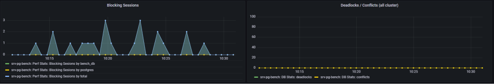

### Test #2: synchronous_commit = off

```
pgbench -h /tmp -p 5432 -c 30 -j 6 -P 60 -T 900 --no-vacuum bench_db
 
progress: 60.0 s, 2261.9 tps, lat 13.255 ms stddev 13.053
progress: 120.0 s, 2007.2 tps, lat 14.934 ms stddev 34.489
progress: 180.0 s, 1320.4 tps, lat 22.730 ms stddev 36.629
progress: 240.0 s, 1659.4 tps, lat 18.084 ms stddev 27.004
progress: 300.0 s, 1466.2 tps, lat 20.452 ms stddev 35.495
progress: 360.0 s, 1292.6 tps, lat 23.210 ms stddev 37.436
progress: 420.0 s, 1766.0 tps, lat 16.989 ms stddev 24.702
progress: 480.0 s, 1445.2 tps, lat 20.751 ms stddev 36.917
progress: 540.0 s, 1350.7 tps, lat 22.204 ms stddev 35.056
progress: 600.0 s, 1737.9 tps, lat 17.262 ms stddev 25.479
progress: 660.0 s, 1489.3 tps, lat 20.146 ms stddev 37.570
progress: 720.0 s, 1369.2 tps, lat 21.900 ms stddev 35.668
progress: 780.0 s, 1684.6 tps, lat 17.818 ms stddev 27.789
progress: 840.0 s, 1568.9 tps, lat 19.117 ms stddev 34.174
progress: 900.0 s, 1352.7 tps, lat 22.178 ms stddev 39.113
transaction type: <builtin: TPC-B (sort of)>
scaling factor: 500
query mode: simple
number of clients: 30
number of threads: 6
duration: 900 s
number of transactions actually processed: 1426362
latency average = 18.929 ms
latency stddev = 32.110 ms
tps = 1584.600394 (including connections establishing)
tps = 1584.607244 (excluding connections establishing)
```

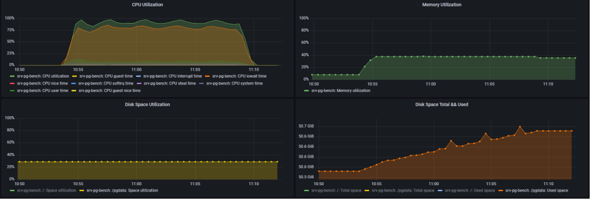
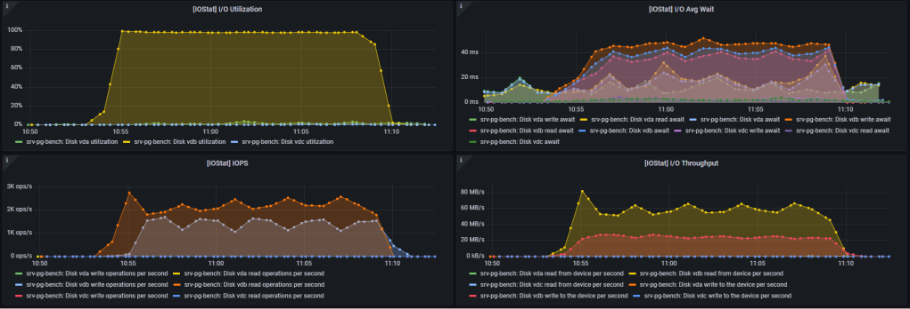
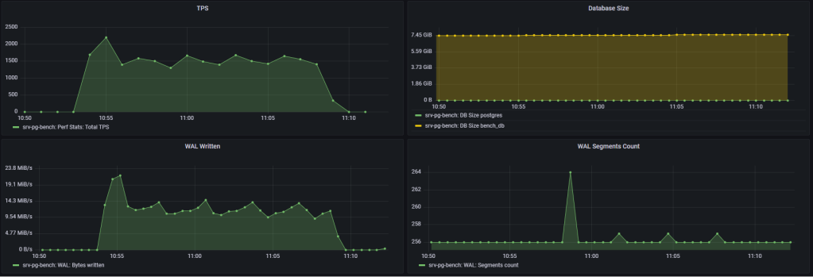
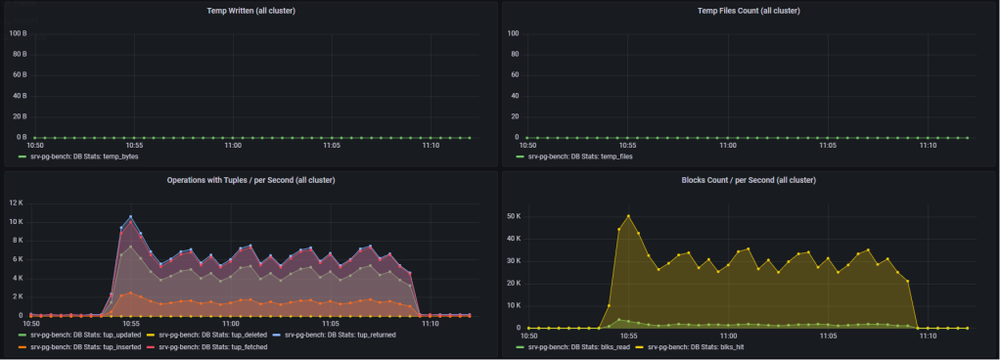
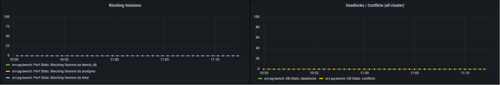


## DB2

```
postgres@bench_db=# \l+ bench_db
                                                  List of databases
   Name   |   Owner   | Encoding |   Collate   |    Ctype    | Access privileges |  Size   | Tablespace | Description
----------+-----------+----------+-------------+-------------+-------------------+---------+------------+-------------
 bench_db | bench_usr | UTF8     | en_US.UTF-8 | en_US.UTF-8 |                   | 1010 MB | pg_default |
(1 row)
 
postgres@bench_db=# \i table_bloat_check.sql
 databasename | schemaname |    tablename     | can_estimate | est_rows | pct_bloat | mb_bloat | table_mb
--------------+------------+------------------+--------------+----------+-----------+----------+----------
 bench_db     | public     | pgbench_history  | f            |        0 |           |          |    0.000
 bench_db     | public     | pgbench_accounts | t            |  6700000 |         1 |    12.60 |  858.102
 bench_db     | public     | pgbench_branches | t            |       67 |         0 |     0.00 |    0.008
 bench_db     | public     | pgbench_tellers  | t            |      670 |         0 |     0.00 |    0.031
(4 rows)
 
postgres@bench_db=# \i index_bloat_check.sql
 database_name | schema_name |    table_name    |      index_name       | bloat_pct | bloat_mb | index_mb | table_mb | index_scans
---------------+-------------+------------------+-----------------------+-----------+----------+----------+----------+-------------
 bench_db      | public      | pgbench_tellers  | pgbench_tellers_pkey  |        25 |        0 |    0.031 |    0.031 |           0
 bench_db      | public      | pgbench_accounts | pgbench_accounts_pkey |        11 |       15 |  143.547 |  858.102 |           0
 bench_db      | public      | pgbench_branches | pgbench_branches_pkey |         0 |        0 |    0.016 |    0.008 |           0
(3 rows)
```

### Test #3: synchronous_commit = on

```
pgbench -h /tmp -p 5432 -c 30 -j 6 -P 60 -T 900 --no-vacuum bench_db
 
progress: 60.0 s, 4058.0 tps, lat 7.382 ms stddev 4.925
progress: 120.0 s, 4190.4 tps, lat 7.150 ms stddev 5.063
progress: 180.0 s, 3475.0 tps, lat 8.625 ms stddev 6.965
progress: 240.0 s, 4845.0 tps, lat 6.183 ms stddev 2.672
progress: 300.0 s, 4820.3 tps, lat 6.214 ms stddev 2.703
progress: 360.0 s, 5003.5 tps, lat 5.987 ms stddev 2.629
progress: 420.0 s, 4769.9 tps, lat 6.281 ms stddev 2.723
progress: 480.0 s, 4827.6 tps, lat 6.205 ms stddev 2.719
progress: 540.0 s, 4829.3 tps, lat 6.203 ms stddev 2.717
progress: 600.0 s, 4835.3 tps, lat 6.195 ms stddev 2.708
progress: 660.0 s, 4472.9 tps, lat 6.698 ms stddev 2.994
progress: 720.0 s, 4700.5 tps, lat 6.373 ms stddev 3.497
progress: 780.0 s, 4818.9 tps, lat 6.217 ms stddev 3.420
progress: 840.0 s, 4635.6 tps, lat 6.462 ms stddev 3.451
progress: 900.0 s, 4807.4 tps, lat 6.231 ms stddev 3.362
transaction type: <builtin: TPC-B (sort of)>
scaling factor: 67
query mode: simple
number of clients: 30
number of threads: 6
duration: 900 s
number of transactions actually processed: 4145394
latency average = 6.504 ms
latency stddev = 3.631 ms
tps = 4605.422270 (including connections establishing)
tps = 4605.441729 (excluding connections establishing)
```

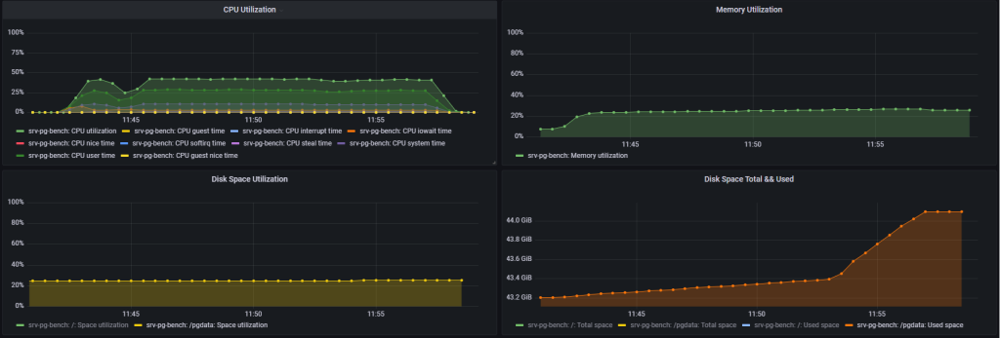
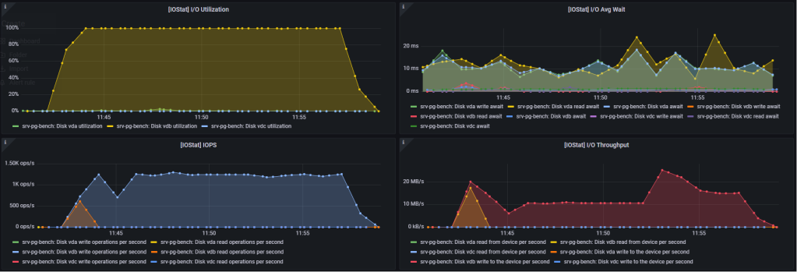
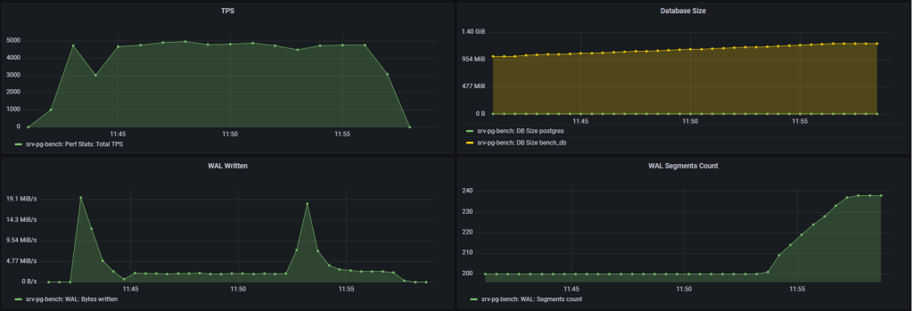
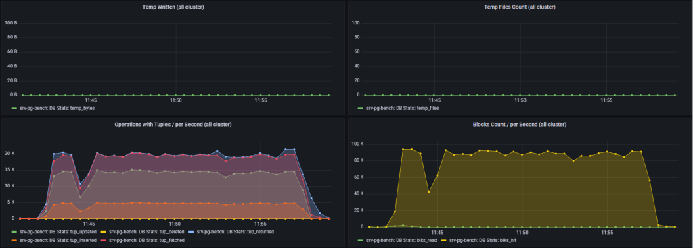
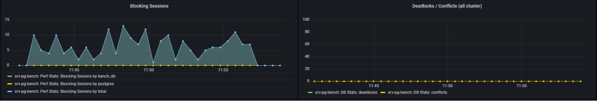

### Test #4: synchronous_commit = off

```
pgbench -h /tmp -p 5432 -c 30 -j 6 -P 60 -T 900 --no-vacuum bench_db
 
progress: 60.0 s, 9470.9 tps, lat 3.160 ms stddev 4.439
progress: 120.0 s, 11634.4 tps, lat 2.571 ms stddev 2.045
progress: 180.0 s, 11799.1 tps, lat 2.535 ms stddev 0.661
progress: 240.0 s, 11436.5 tps, lat 2.616 ms stddev 0.641
progress: 300.0 s, 11581.4 tps, lat 2.583 ms stddev 3.627
progress: 360.0 s, 11512.7 tps, lat 2.599 ms stddev 0.704
progress: 420.0 s, 11672.4 tps, lat 2.562 ms stddev 1.068
progress: 480.0 s, 11867.1 tps, lat 2.520 ms stddev 0.677
progress: 540.0 s, 11773.1 tps, lat 2.541 ms stddev 0.816
progress: 600.0 s, 11405.6 tps, lat 2.623 ms stddev 0.677
progress: 660.0 s, 11804.1 tps, lat 2.534 ms stddev 0.729
progress: 720.0 s, 11820.1 tps, lat 2.530 ms stddev 0.701
progress: 780.0 s, 11689.8 tps, lat 2.559 ms stddev 2.947
progress: 840.0 s, 11635.1 tps, lat 2.572 ms stddev 0.674
progress: 900.0 s, 11832.6 tps, lat 2.528 ms stddev 0.748
transaction type: <builtin: TPC-B (sort of)>
scaling factor: 67
query mode: simple
number of clients: 30
number of threads: 6
duration: 900 s
number of transactions actually processed: 10376133
latency average = 2.595 ms
latency stddev = 1.807 ms
tps = 11527.846946 (including connections establishing)
tps = 11527.895835 (excluding connections establishing)
```

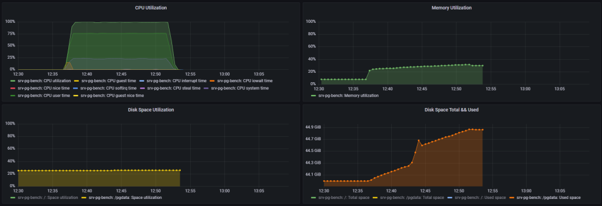
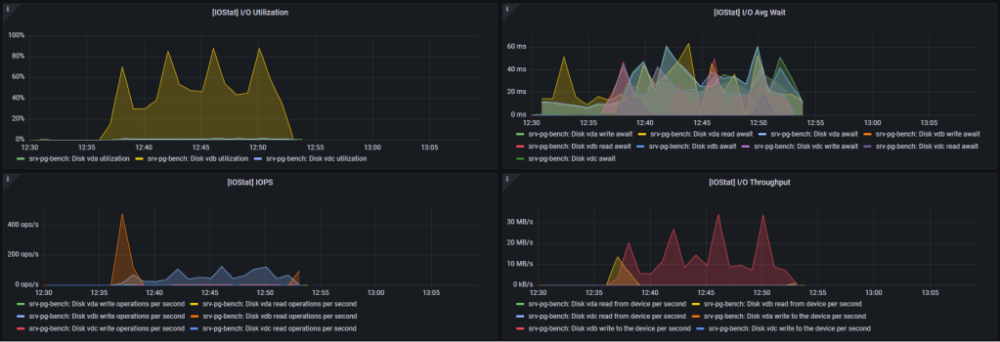
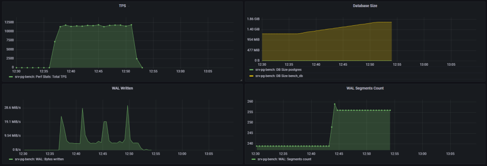
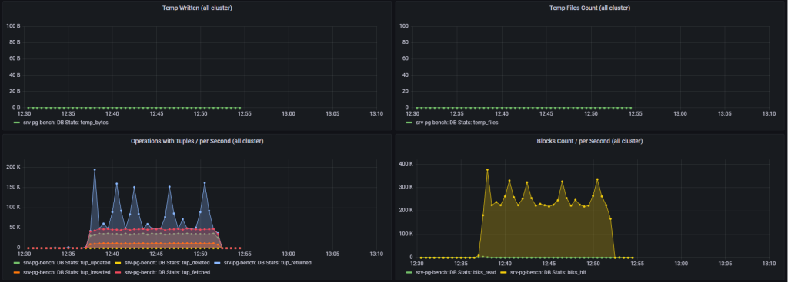
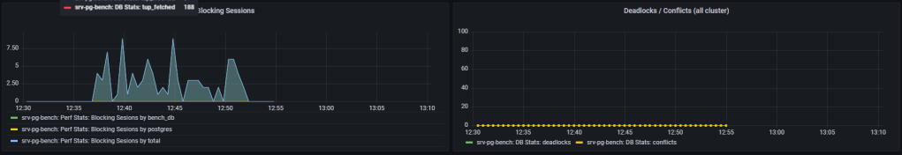


## Summary

Setting `synchronous_commit = off` will:

- Increase database transactions throughput (TPS)
- Increase CPU usage
- Will NOT decrease CPU iowaits


## About Data Loss

Ref. to [Percona blog post:](https://www.percona.com/blog/postgresql-synchronous_commit-options-and-synchronous-standby-replication/)

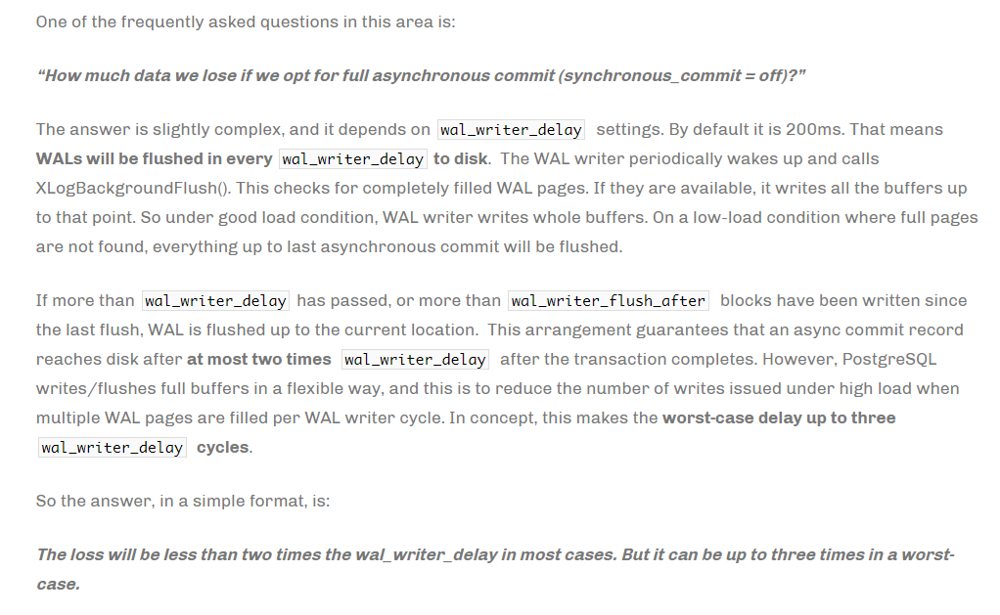

---

<p align="center"><strong><sub>DISCLAIMER</sub></strong></p>

<p align="center">
<sub>
The information presented here is intended for informational purposes only.
The author assumes no responsibility or liability for any damages resulting
from the application of the techniques described herein. Use this content at
your own risk.
<br><br>
Always create backups and test configurations thoroughly before implementing
them in live environments.
</sub>
</p>
